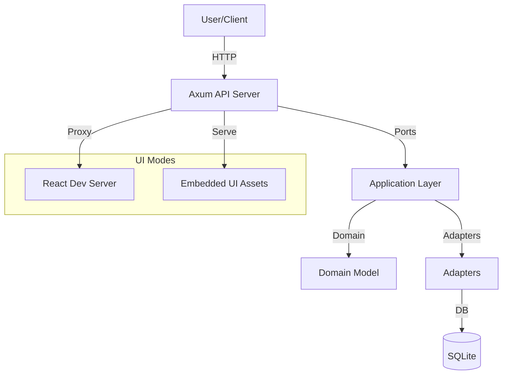

# Architecture

## Overview
ReAuth follows hexagonal architecture in the backend and feature-sliced design (FSD) in the UI. The system can run with a separate UI dev server for rapid iteration or embed a static UI into the Rust binary for single-file deployment.

Key code locations:
- Backend crate: ``
- UI app: `reauth/ui`

## System diagram

## Backend layers (hexagonal)
- Domain: core entities and rules in `/src/domain`.
- Ports: interfaces for persistence, caching, token, eventing, and transactions in `/src/ports`.
- Application: use cases and orchestration services in `/src/application`.
- Adapters: concrete implementations for ports in `/src/adapters`.
- Bootstrap: wiring, config, migrations in `/src/bootstrap`.

## Application services (current)
- Auth, OIDC, RBAC, Realm, User services.
- Flow engine, flow executor, flow manager, runtime and node registries.

## Ports (current)
- Repositories for user, realm, flow, OIDC, session, RBAC.
- Token service, cache service, event bus, transaction manager.

## Adapters (current)
- Web adapter (Axum handlers, routing, middleware): `/src/adapters/web`.
- Persistence (SQLite repositories + migrations): `/src/adapters/persistence`.
- Auth adapters (password/cookie): `/src/adapters/auth`.
- Crypto (Argon2, JWT, key management): `/src/adapters/crypto`.
- Cache (Moka + invalidation): `/src/adapters/cache`.
- Eventing (in-memory bus + log broadcast): `/src/adapters/eventing`.
- Logging (tracing + banner): `/src/adapters/logging`.

## UI architecture (FSD)
- App shell and providers: `reauth/ui/src/app`.
- Pages: `reauth/ui/src/pages`.
- Widgets: `reauth/ui/src/widgets`.
- Features: `reauth/ui/src/features`.
- Entities: `reauth/ui/src/entities`.
- Shared (UI, api, hooks, config, libs, store): `reauth/ui/src/shared`.

## UI delivery modes
- Dev mode: API proxies UI requests to the React dev server when `embed-ui` feature is not enabled.
- Embedded mode: UI is bundled via `rust-embed` and served by the API when `embed-ui` is enabled.

## Cross-cutting concerns
- Performance and footprint as first-class requirements.
- Configuration and environment settings in `/src/config.rs`.
- Logging and observability via tracing.
- Caching and eventing via adapters.
