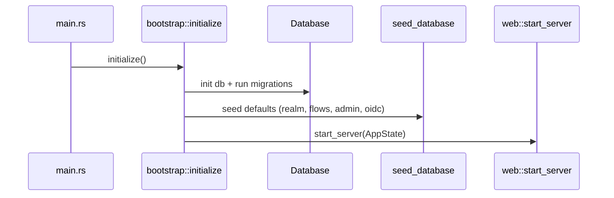
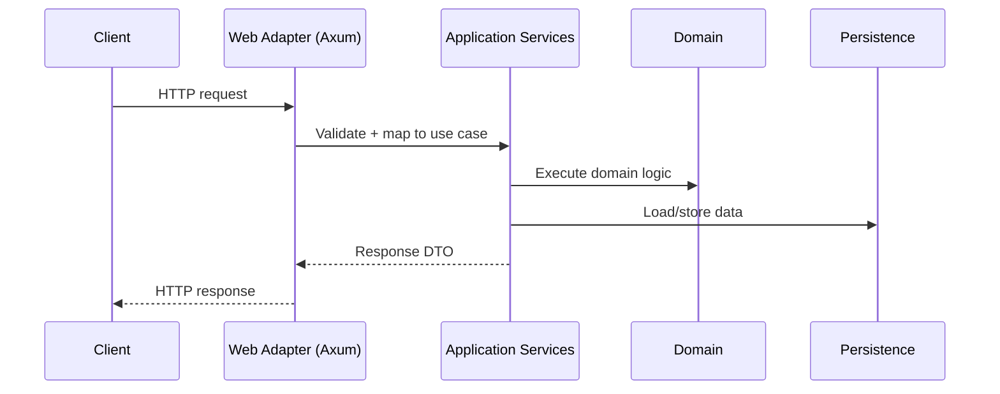
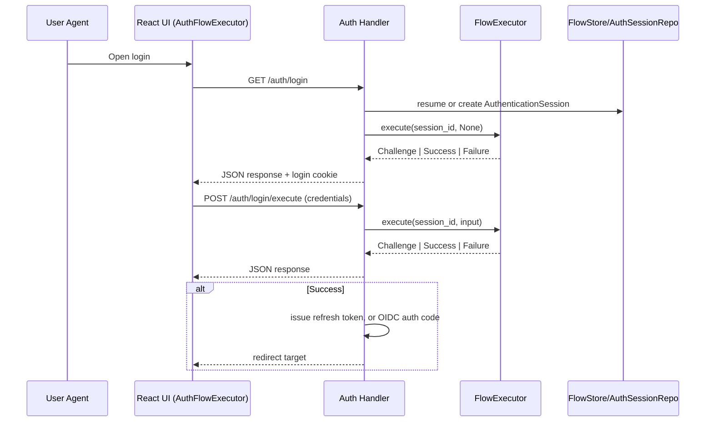
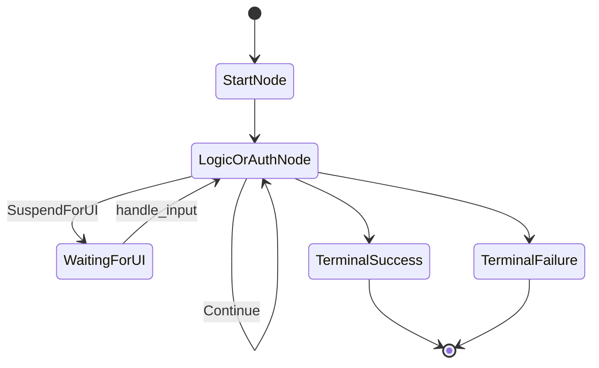

# Control Flow

## Scope
This doc captures the primary control paths and state transitions. It is intentionally high level and stable. Protocol specifics live in `reauth/docs/memory/04-oidc-sso-flows.md`. Flow-builder internals live in `reauth/docs/memory/05-flow-builder.md`.

## Backend startup

## Request lifecycle (API)

## Login flow (browser, high level)
Primary entry points:
- Start: `GET /api/realms/{realm}/auth/login`
- Step submit: `POST /api/realms/{realm}/auth/login/execute`

## Flow execution state machine
Graph execution is driven by `AuthenticationSession` + `ExecutionPlan`.

## UI boot and auth gating
- Auth guard checks:
  1. OIDC callback code in URL -> exchange token
  2. If no code, attempt refresh token
  3. If unauthenticated, redirect to `/#/login?redirect=...`
- Login page mounts `AuthFlowExecutor` which drives the flow via API calls.

## UI delivery modes
- Dev mode: API proxies UI routes to React dev server when `embed-ui` is disabled.
- Embedded mode: API serves static assets from the binary when `embed-ui` is enabled.

## Flow catalog (summary)
All auth flows share the same execution engine. Per-flow details live in `reauth/docs/memory/11-auth-flow-catalog.md`.
