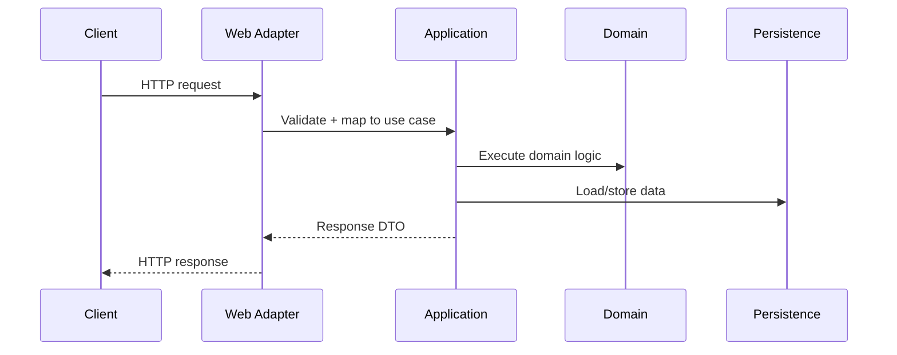

# Control Flow

## Backend startup
- TODO

## Request lifecycle (high level)

```mermaid
sequenceDiagram
  participant C as Client
  participant W as Web Adapter
  participant A as Application
  participant D as Domain
  participant P as Persistence
  C->>W: HTTP request
  W->>A: Validate + map to use case
  A->>D: Execute domain logic
  A->>P: Load/store data
  A-->>W: Response DTO
  W-->>C: HTTP response
```

## UI boot flow
- TODO

## Embed UI flow
- TODO
