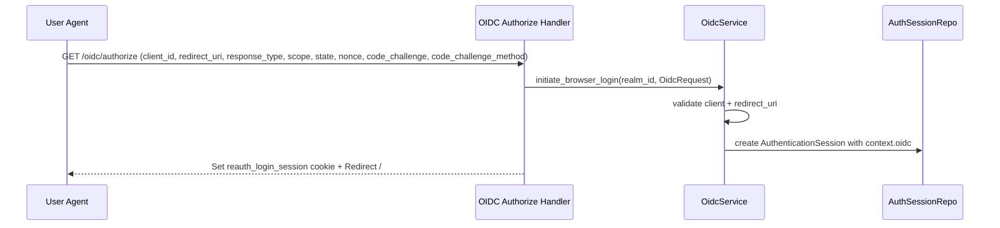
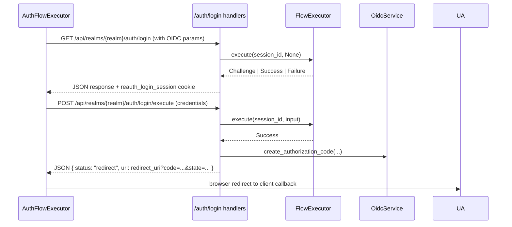
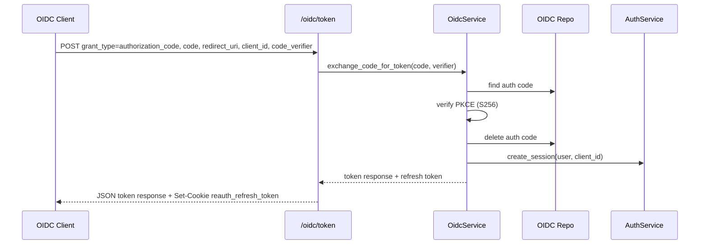
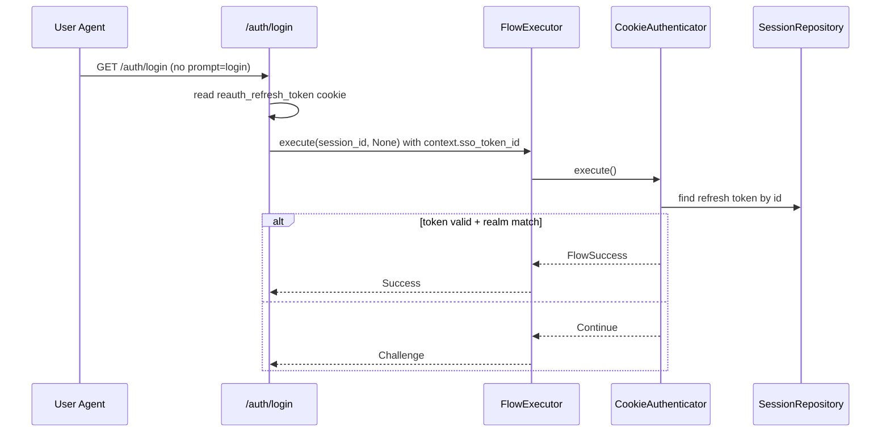

# OIDC and SSO Flows

This doc is limited to behavior implemented in code today. It focuses on the Authorization Code + PKCE flow and the SSO cookie path.

## Endpoints (current)
- Authorize: `GET /api/realms/{realm}/oidc/authorize`
- Token: `POST /api/realms/{realm}/oidc/token` (form urlencoded)
- JWKS: `GET /api/realms/{realm}/oidc/.well-known/jwks.json`

## OIDC authorization (authorize -> login UI)

Notes (from code):
- `initiate_browser_login` validates the client and redirect URI before creating the session.
- OIDC context is stored in `AuthenticationSession.context.oidc` for use after login.

## Login UI and code issuance
The login UI uses `AuthFlowExecutor` and the browser flow template. On success, the backend issues an authorization code and returns a redirect URL to the client.

Notes (from code):
- The login handler checks `AuthenticationSession.context.oidc` to decide whether to issue an auth code.
- If a valid SSO token is present in context, the handler skips creating a new root session.

## Token exchange (code -> tokens)

Notes (from code):
- PKCE verification always uses SHA-256; `plain` is not supported.
- The auth code TTL is 300 seconds.
- The token response includes `access_token`, `id_token`, `token_type`, and `expires_in`.

## SSO cookie path (browser flow)
The browser flow template starts with a cookie authenticator. If a valid refresh token is present, it short-circuits to success.

Notes (from code):
- SSO token is the `reauth_refresh_token` cookie.
- Realm isolation is enforced: token realm must match session realm.
- If `prompt=login`, the SSO cookie is ignored.
