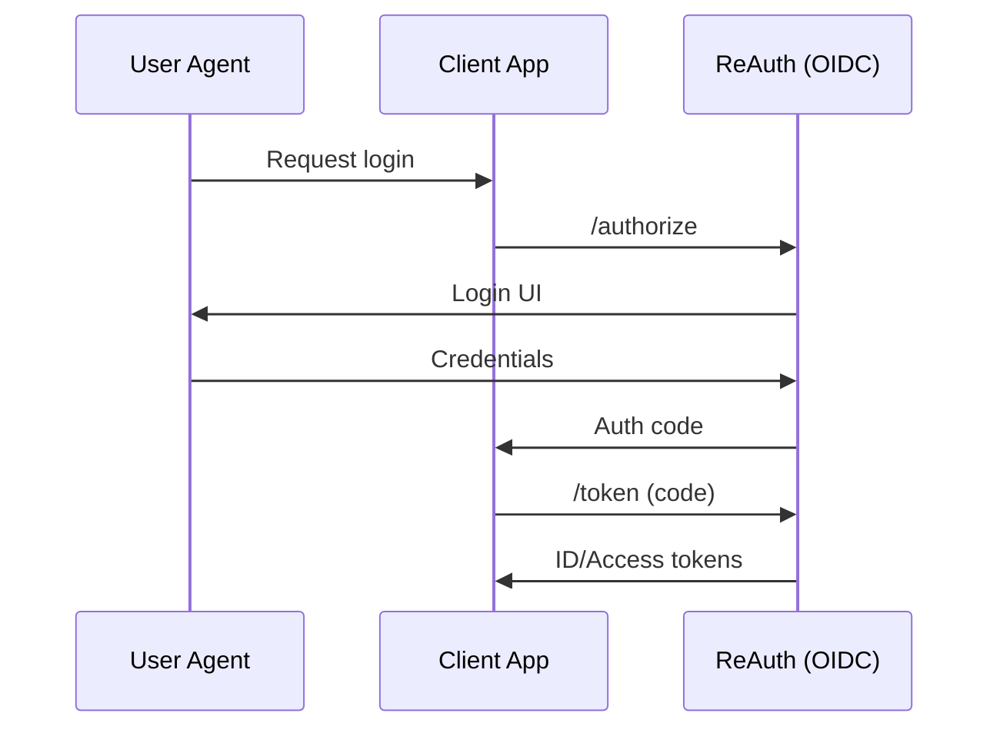

# OIDC and SSO Flows

## Authorization Code (OIDC)

```mermaid
sequenceDiagram
  participant U as User Agent
  participant C as Client App
  participant I as ReAuth (OIDC)
  U->>C: Request login
  C->>I: /authorize
  I->>U: Login UI
  U->>I: Credentials
  I->>C: Auth code
  C->>I: /token (code)
  I->>C: ID/Access tokens
```

## SSO (high level)
- TODO

## Session and refresh flow
- TODO
