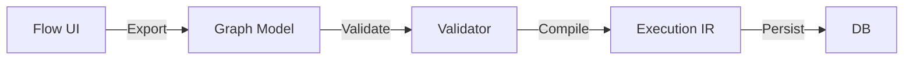

# Flow Builder

## Purpose
- TODO

## UI architecture (React Flow)
- TODO

## Flow model (nodes/edges)
- TODO

## Compilation pipeline

```mermaid
graph LR
  UI[Flow UI] -->|Export| Graph[Graph Model]
  Graph -->|Validate| Validator
  Validator -->|Compile| IR[Execution IR]
  IR -->|Persist| Storage[DB]
```

## Execution runtime
- TODO
