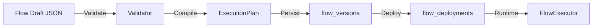

# Flow Builder

## Purpose
A visual editor for auth flows using React Flow. The builder persists drafts, publishes versions, and deploys a flow per realm + flow type.

## UI architecture (FSD)
- Page shell: `reauth/ui/src/pages/flow/builder/FlowBuilderPage.tsx`
- Canvas: `reauth/ui/src/features/flow-builder/components/FlowCanvas.tsx`
- Palette: `reauth/ui/src/features/flow-builder/components/NodePalette.tsx`
- Inspector: `reauth/ui/src/features/flow-builder/components/NodeInspector.tsx`
- Store (Zustand): `reauth/ui/src/features/flow-builder/store/flowBuilderStore.ts`
- Node type mapping: `reauth/ui/src/entities/flow/config/nodeTypes.ts`

## Backend APIs used
- List nodes: `GET /api/realms/{realm}/flows/nodes`
- List drafts: `GET /api/realms/{realm}/flows/drafts`
- Create draft: `POST /api/realms/{realm}/flows/drafts`
- Get draft: `GET /api/realms/{realm}/flows/drafts/{id}`
- Update draft: `PUT /api/realms/{realm}/flows/drafts/{id}`
- Publish flow: `POST /api/realms/{realm}/flows/{id}/publish`
- List versions: `GET /api/realms/{realm}/flows/{id}/versions`
- Rollback: `POST /api/realms/{realm}/flows/{id}/rollback`
- Restore draft from version: `POST /api/realms/{realm}/flows/{id}/restore-draft`

## Node registry and palette
- Backend node catalog comes from `NodeRegistryService` and `NodeProvider` definitions:
  - Registry: `/src/application/node_registry.rs`
  - Providers: `/src/domain/flow/nodes/*`
- The palette uses `GET /flows/nodes` to populate available nodes and their config schemas.

## Draft persistence
- Drafts are stored as `flow_drafts.graph_json` (raw React Flow JSON).
- UI stores graph in Zustand and serializes via `toObject()`.
- Save draft uses `PUT /flows/drafts/{id}` and sends `graph_json` as JSON; backend stores it as a string.

## Publish pipeline (code-accurate)
1. Load draft (`FlowManager::get_draft`).
2. Parse `graph_json` into JSON value.
3. Validate graph (`GraphValidator`): exactly one start node, no dead ends for non-terminal nodes.
4. Compile to `ExecutionPlan` (`FlowCompiler`).
5. Save `flow_versions` (artifact + graph_json + version_number).
6. Upsert `flow_deployments` for (realm_id, flow_type).
7. Auto-bind realm flow slot if the flow type is recognized.
8. Delete draft after publish.

Relevant code:
- `/src/application/flow_manager/mod.rs`
- `/src/domain/compiler/*`

## Graph format expectations
- Graph JSON must contain `nodes` and `edges` arrays.
- Each node must include `id` and `type` (type is the registry key like `core.auth.password`).
- Node config is read from `node.data.config`.
- Edge routing uses `sourceHandle` to match outputs.

## Execution artifact
- The compiler converts graph JSON into `ExecutionPlan` (nodes + start node).
- The executor reads `ExecutionPlan` and uses node `config.auth_type` to select a worker.
- Execution uses `AuthenticationSession` for state and context.

## Flow execution summary

