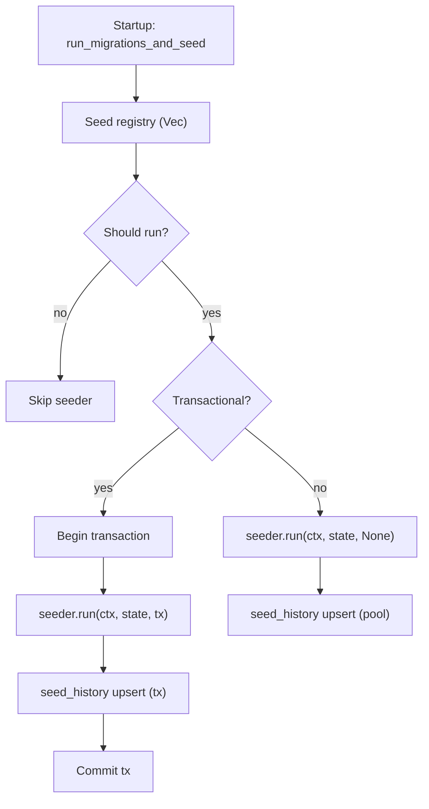
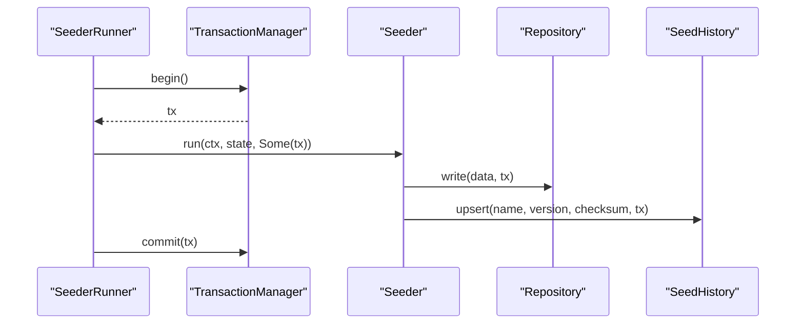

# Seeding (Defaults + Unit of Work)

## Purpose
Keep default data creation modular, repeatable, and safe as the system grows. Seeding runs after migrations on startup and is designed to be idempotent.

## Key concepts
- **Seeder**: A small unit of default data creation with a name, version, checksum, and a `run` implementation.
- **Seed registry**: Ordered list of seeders executed by the orchestrator.
- **Seed history**: A table that tracks which seeders ran, their version, and checksum.
- **Unit of work (UoW)**: Per‑seeder transaction boundary. If a seeder is transactional, all writes inside it succeed or fail together.

## Execution flow

## Unit of work pattern (transactions)
Each seeder can opt into a transaction by returning `transactional = true`. The orchestrator manages the transaction lifetime and passes a mutable `Transaction` handle into the seeder.

Notes:
- Seeders that do not opt in run without a transaction and write directly to the pool.
- Repositories that accept a `Transaction` can participate in the same UoW.
- If the seeder errors, the transaction is rolled back and no history is recorded.

## What is seeded today
- Default realm (`master`)
- Default auth flows + bindings
- Default admin user + role + permissions
- Default OIDC client (`reauth-admin`, managed by config)

## Seed history
The seed history table is the source of truth for which seeders have run:
- Table: `seed_history`
- Columns: `name`, `version`, `checksum`, `applied_at`

See:
- `reauth/migrations/20260218101500_seed_history.sql`
- `reauth/crates/reauth_core/src/bootstrap/seed/history.rs`

## Seed registry and context
Key modules:
- `reauth/crates/reauth_core/src/bootstrap/seed.rs` (orchestrator + registry)
- `reauth/crates/reauth_core/src/bootstrap/seed/context.rs` (shared services + settings)
- `reauth/crates/reauth_core/src/bootstrap/seed/realm.rs`
- `reauth/crates/reauth_core/src/bootstrap/seed/flows.rs`
- `reauth/crates/reauth_core/src/bootstrap/seed/admin.rs`
- `reauth/crates/reauth_core/src/bootstrap/seed/oidc.rs`

The `SeedContext` provides:
- Services (realm/user/flow/oidc/rbac)
- Repositories (flow repo + flow store)
- Resolved `Settings`

## Diagnostics and CLI
- `--seed-only` runs migrations + seeding and exits.
- `--seed-status` prints applied seeders from `seed_history`.

## Extending seeding
When adding a new default:
1. Add a new seeder module under `bootstrap/seed/`.
2. Register it in `seed.rs` in the desired order.
3. Decide if it needs a transaction (`transactional = true`).
4. Set `version` and `checksum` to define idempotency boundaries.
5. Update `docs/memory/roadmaps/seeding.md` if the workflow changes.
