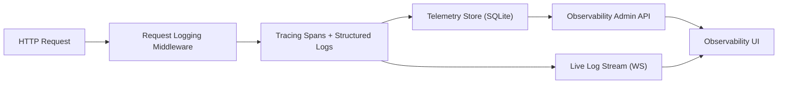
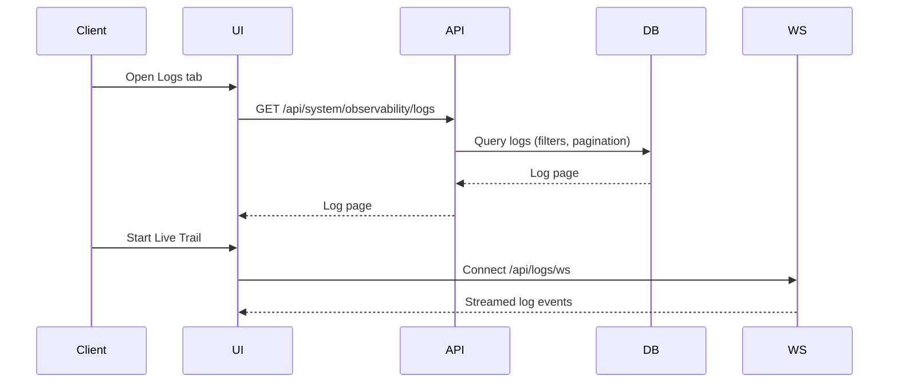
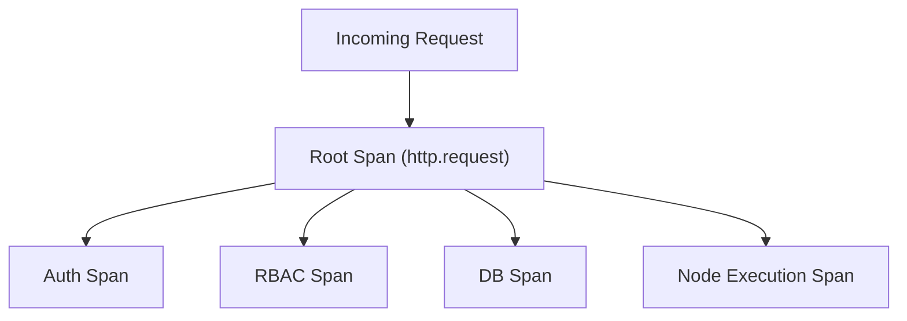
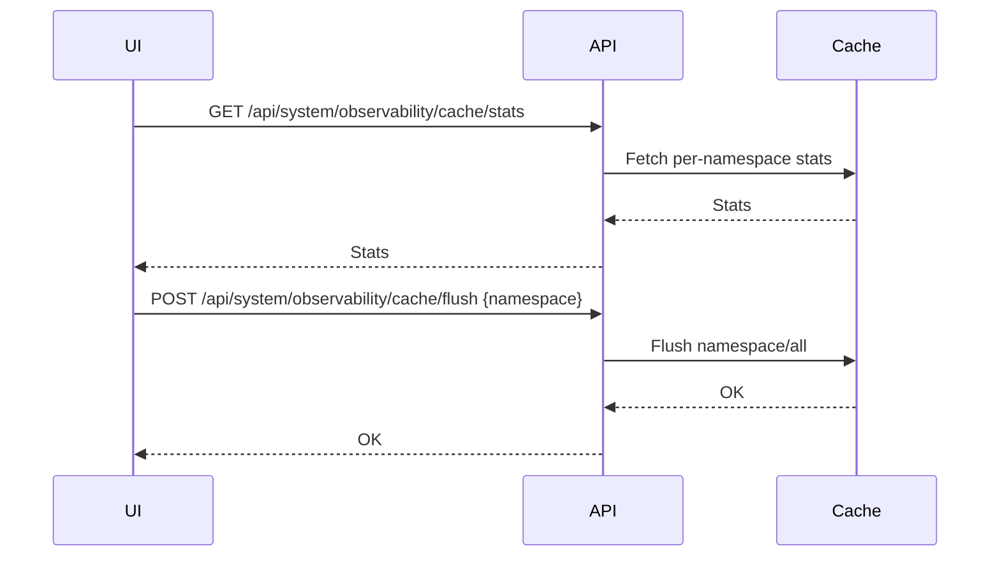

# Observability

**Overview**
- ReAuth ships a built-in observability engine for logs, traces, and cache health.
- Telemetry is captured by Rust tracing instrumentation and persisted to a dedicated SQLite database (`reauth_telemetry.db`).
- The admin API (`/api/system/observability`) powers the UI and external tooling.

**Logs**
Purpose
- Provide searchable, structured events for debugging and audits.
- Capture request context consistently: request_id, trace_id, span_id, user_id, realm, method, route, status, duration.

Functionality
- Live Trail (WebSocket) for real-time logs.
- Manual refresh for stored logs (no background polling).
- Filters: level, module/target, search term.
- Time range filter for stored logs.
- Pagination and sorting handled server-side.
- Toggle to include or hide `trace.span` rows.
- Table columns: timestamp, level, request, status, duration, trace_id, user, realm.
- Expanded rows show full structured metadata.
- Manual cleanup: clear stored logs from telemetry storage.

**Traces**
Purpose
- Visualize request execution with spans and durations.
- Support waterfall-style trace inspection (parent/child relationships).

Functionality
- Request list shows top-level traces (method, route, status, duration).
- Trace detail view displays spans ordered by start time with durations.
- Time range filter, search, pagination, sorting (server-side).
- Trace IDs link from logs to trace detail.
- Manual cleanup: clear stored traces from telemetry storage.

**Cache Manager**
Purpose
- Monitor and control internal caches to keep performance predictable.

Functionality
- Overall cache stats: hit rate, item count, memory usage.
- Namespace table with per-namespace stats.
- Per-namespace purge.
- Global flush with confirmation prompt.

**Metrics**
Purpose
- Provide baseline request volume and latency visibility for dashboards.

Functionality
- Request count.
- Latency histogram (avg, p50/p95 as available).
- Error rate derived from 5xx status counts.

**Admin API**
All routes are under `/api/system/observability` and require `EVENT_READ`.

Logs
- `GET /logs`
- Query params: `level`, `target`, `search`, `start`, `end`, `page`, `per_page`, `sort_by`, `sort_dir`, `include_spans`.
- `POST /logs/clear` (optional body: `{ "before": "<RFC3339>" }`).

Traces
- `GET /traces`
- Query params: `search`, `start`, `end`, `page`, `per_page`, `sort_by`, `sort_dir`.
- `GET /traces/{trace_id}` returns spans for the waterfall.
- `POST /traces/clear` (optional body: `{ "before": "<RFC3339>" }`).

Metrics
- `GET /metrics`

Cache
- `GET /cache/stats` (optional `namespace`).
- `POST /cache/flush` with JSON body `{ "namespace": "all" | "<name>" }`.

**Notes**
- `start` and `end` timestamps must be RFC3339.
- Live Trail is powered by `/api/logs/ws` and does not read from SQLite.
- Telemetry cleanup is scheduled internally (no OS cron). Configure via:
  - `observability.log_retention_days`
  - `observability.trace_retention_days`
  - `observability.cleanup_interval_secs`
