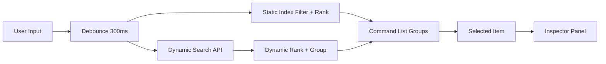
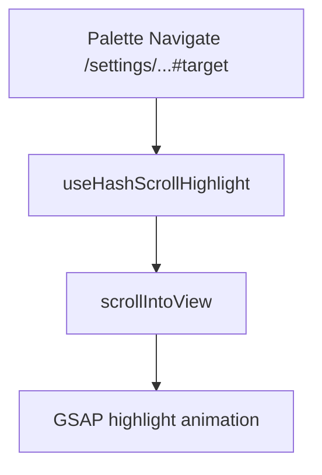
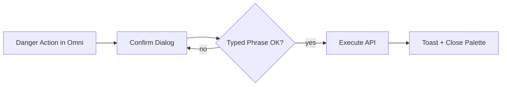

# Omni Search (Command Palette)

## Purpose
Omni Search provides a Raycast-style, global command palette for ReAuth. It unifies navigation, settings, and entity search into one fast, keyboard-first surface with a split-pane inspector and safe inline actions.

## System Design
### Unified Search Architecture
- Static index (synchronous): navigation routes, settings, and inline actions are loaded on the client and filtered instantly.
- Dynamic search (asynchronous): DB-backed results for users, clients, roles, groups, and flows are fetched from the backend via a debounced search endpoint.

### Backend Search Endpoint
- Endpoint: `GET /api/realms/{realm}/search?q=...&limit=...`
- Permissions:
  - Users require `user:read`
  - Clients require `client:read`
  - Roles and groups require `rbac:read`
  - Flows require `realm:read`
  - Webhooks require `realm:read` (or a future `webhook:read`)
- Server-side aggregation:
  - Users, clients, roles, groups are filtered via `PageRequest` and mapped to lightweight DTOs.
  - Flows are assembled by merging runtime flows with drafts and then filtered by query.
  - Webhooks are filtered by name/url and mapped to lightweight DTOs (id, name, url, http_method, status).

### Frontend Data Flow
- Input is debounced (300ms) and sent to the backend for dynamic items.
- Static items are ranked locally with fuzzy scoring and recency boosts.
- Dynamic items are ranked locally with the same scoring and recency boosts.
- A unified list is rendered in grouped sections, with an inspector that syncs to the current keyboard selection.

## UI Layout and Interaction
### Layout
- Modal: centered, wide (max-w-4xl) with blurred backdrop.
- Split pane:
  - Left: search input and grouped list of results.
  - Right: inspector panel for the selected item.
- Large input with full border and rounded corners.

### Specialized Rows
- Settings rows: `CommandSettingRow` adds an inline `Switch` with stop propagation.
- Entity rows: `CommandEntityRow` shows avatar/logo and stacked primary/secondary text.

### Inspector
- Inspector renders context for the highlighted item:
  - Users: avatar, status badge, ID, actions.
  - Settings: icon, description, breadcrumb, open button.
  - Clients/Roles/Groups/Flows: icon, label, metadata, open button.

### Keyboard and Accessibility
- `Alt+1/2/3` jumps to the first three visible groups.
- Inspector syncs with keyboard selection (not only mouse hover).
- Skip links and focus rings on split-pane regions.
- Inspector uses `aria-describedby` to announce the selected item label.

## Scroll & Highlight
When navigating to a setting with a hash:
1. The palette navigates to the URL including the hash.
2. `useHashScrollHighlight` detects `window.location.hash`.
3. The target is scrolled into view and highlighted with GSAP.

## Dangerous Actions
Danger actions are never executed directly without confirmation.
- Omni actions open a confirmation dialog that requires a typed phrase.
- The dialog offers “Open in Observability” so users can navigate to the relevant page.
- Logs, Traces, Cache danger zones have hash targets for deep linking.

## Key Files
- Backend search aggregation:
  - `crates/reauth_core/src/adapters/web/search_handler.rs`
- Frontend palette:
  - `ui/src/features/Search/components/OmniCommandPalette.tsx`
  - `ui/src/features/Search/components/PaletteInspector.tsx`
  - `ui/src/features/Search/components/CommandSettingRow.tsx`
  - `ui/src/features/Search/components/CommandEntityRow.tsx`
- Types and search:
  - `ui/src/features/Search/model/omniTypes.ts`
  - `ui/src/features/Search/api/useOmniSearch.ts`
  - `ui/src/features/Search/model/omniRanking.ts`
- Scroll + highlight:
  - `ui/src/shared/hooks/useHashScrollHighlight.ts`
  - `ui/src/shared/lib/animations/gsap.engine.ts`
  - `ui/src/app/style/index.css`

## Adding More Items
### Add a Static Item
1. Update `useOmniStaticItems` with a new item in the appropriate group.
2. If it needs highlighting, add a stable `hash` and ensure the target page wraps the section with the same `id`.
3. If it is a dangerous action, add an `actionId`, `href`, `hash`, and extend `dangerActionConfig` in `OmniCommandPalette`.

### Event Routing Items (Static)
Add static items that deep-link into Event Routing tabs:
- `Event Routing` → `/:realm/events?tab=webhooks`
- `Event Routing — HTTP Webhooks` → `/:realm/events?tab=webhooks`
- `Create Webhook Endpoint` → `/:realm/events?tab=webhooks` (opens the page; user clicks “Add Webhook”)

### Add a Dynamic Entity Type
1. Backend: extend `SearchResponse` in `search_handler.rs` and return a new list.
2. Frontend types: update `OmniSearchResponse` in `omniTypes.ts`.
3. Ranking: add a `rankedX` list in `OmniCommandPalette.tsx`.
4. Rendering: add a new `CommandGroup` section and map to rows.
5. Inspector: extend `OmniInspectorItem` union and render in `PaletteInspector`.

Example: Webhook Endpoints (DB-backed)
- Add `webhooks` to `SearchResponse` with fields: `id`, `name`, `url`, `http_method`, `status`.
- Render a “Webhooks” group with rows that deep-link to `/:realm/events/webhooks/:id`.

### Add a New Action With Confirmation
1. Add a static item with `kind: 'action'` and a unique `actionId`.
2. Add `dangerActionConfig` entry with `confirmText` and description.
3. Implement the action in `executeAction`.
4. Provide a `href` + `hash` for the corresponding page section.

## Future Enhancements
- Saved searches and pinned actions.
- Cross-realm search for super admins.
- Deeper inspector cards (last login, role summaries, audit links).
- Multi-select batch actions.
