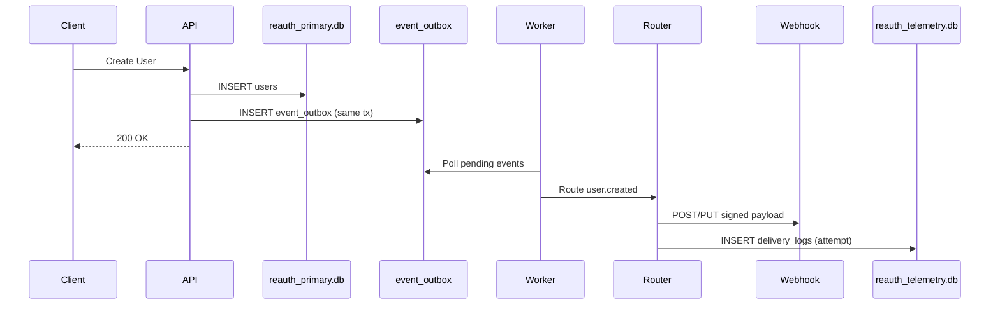
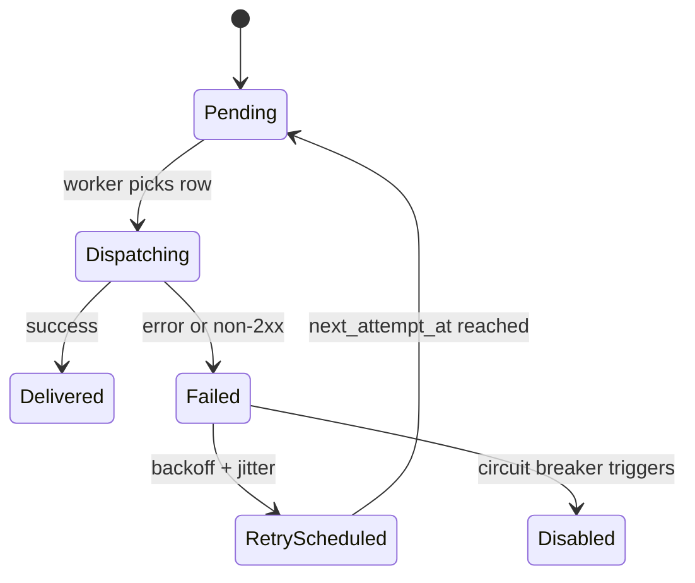
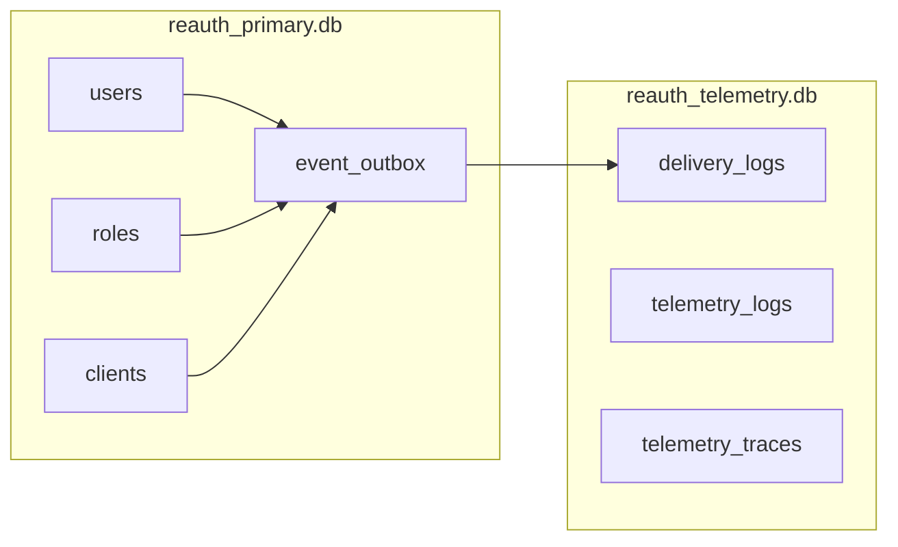

# Webhooks & Event Routing (ReAuth)

## Overview
ReAuth uses a transactional outbox + background worker to deliver domain events to:
- HTTP Webhooks (external systems)

The system is designed to keep the request path fast while guaranteeing durable, at-least-once delivery.

## Core Concepts
- **Domain Events**: Strictly typed events emitted by core services (users, RBAC, etc.).
- **Event Envelope**: Standard payload wrapper for versioning and metadata.
- **Transactional Outbox**: Events written in the same DB transaction as the state change.
- **Outbox Worker**: Background job that fetches pending events and dispatches them.
- **Unified Router**: Resolves webhook destinations and fans out deliveries.
- **Delivery Logs**: Every attempt is recorded with status, latency, and error chain.
- **Retry + Circuit Breaker**: Backoff with jitter and auto-disable on repeated failures.

## Event Envelope (v1)
Each event is wrapped before it is delivered.

```json
{
  "event_id": "evt_123",
  "event_type": "user.created",
  "event_version": "v1",
  "occurred_at": "2026-02-25T03:14:37.327964+00:00",
  "realm_id": "ff5c63a3-6951-4fbe-8094-f74c99b2d6c3",
  "actor": null,
  "data": {
    "user_id": "bdb6042a-ff0a-4f23-ad05-a41ab605cffa",
    "username": "user3"
  }
}
```

## Delivery Semantics
- **At-least-once** delivery.
- Every event includes `Reauth-Event-Id` so consumers can deduplicate.
- Exactly-once is intentionally avoided due to HTTP limitations.

## Storage Strategy (SQLite)
Single binary, no external dependencies:
- `reauth_primary.db`: users, roles, clients, auth data + `event_outbox`
- `reauth_telemetry.db`: `delivery_logs`, telemetry logs, (audit can move later)

Why separate DBs?
- Telemetry writes are heavy.
- SQLite allows one writer at a time per DB.
- Splitting prevents delivery logging from blocking auth reads/writes.

## Outbox Pattern
When a domain write happens:
- Write the primary data (e.g., user row).
- Insert an outbox row in the **same transaction**.
- Commit once; no window for lost events.

## Worker + Router Pipeline
1. Worker polls pending outbox rows.
2. Router resolves targets:
   - Webhook endpoints subscribed to the event.
3. Dispatchers deliver:
   - HTTP: signed request with HMAC-SHA256.
4. Log every attempt into `delivery_logs`.
5. Failed deliveries enqueue retry with jittered backoff.

## HTTP Delivery
Headers:
- `Reauth-Event-Id`
- `Reauth-Event-Type`
- `Reauth-Event-Version`
- `Reauth-Signature` (HMAC-SHA256 of payload with endpoint secret)

Methods:
- Supported methods include `POST` and `PUT`.

## Retry + Circuit Breaker
Backoff schedule with jitter:
- 1m, 5m, 30m, 2h, 12h (each with +-20% jitter)

Circuit breaker:
- After N consecutive failures, endpoint becomes `disabled_system`.
- Admin can re-enable once fixed.

## Delivery Logs
Each attempt records:
- event id, target id/type, response status/body
- error and error chain (reqwest errors)
- latency and timestamps

These logs power:
- Delivery inspector UI
- Replay endpoint
- Routing metrics

## Mermaid Diagrams

### 1) End-to-End Flow


### 2) Outbox Worker State Machine


### 3) Storage Separation


## Current Gaps / Next Steps
- Expand event emission across more backend domains (clients, flows, sessions, tokens, audits).
- Publish a full event catalog for UI subscriptions.
- Add optional payload compression for large events.
