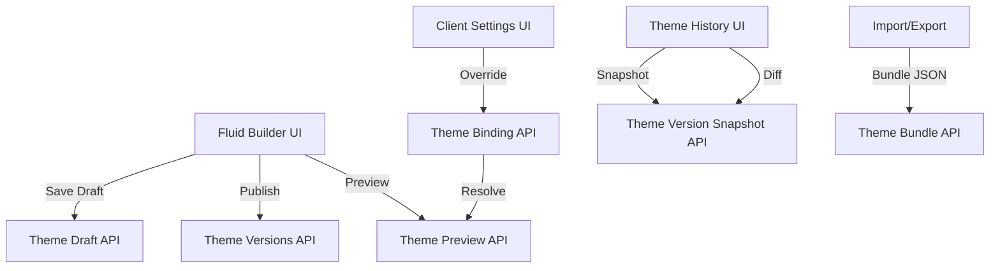
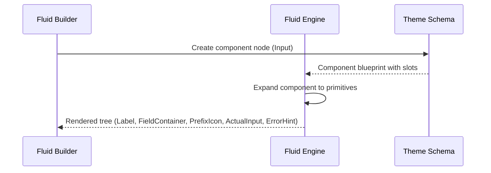
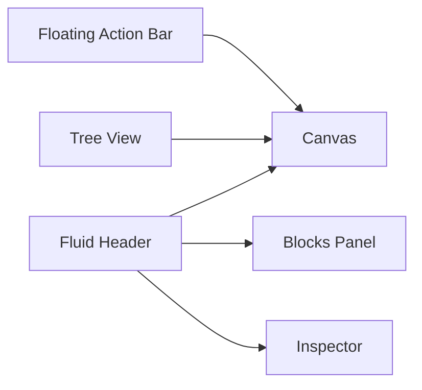
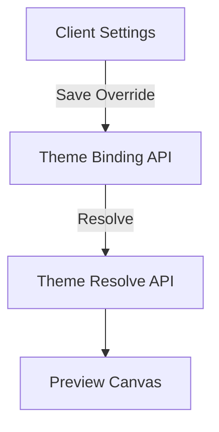
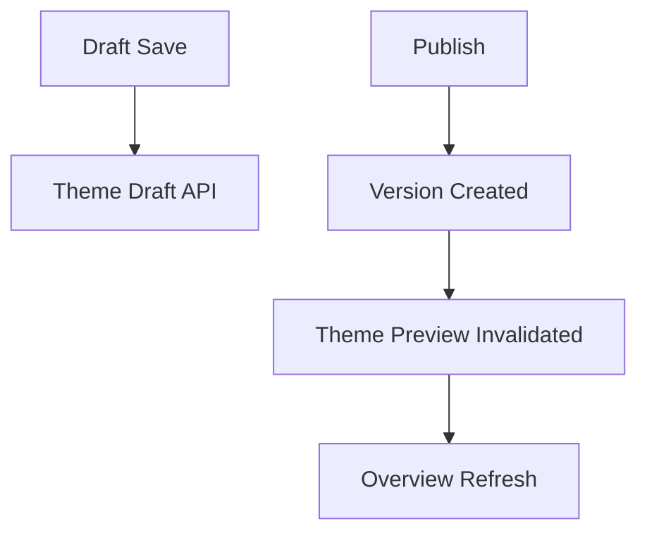

# Fluid Theme Builder LLD

Date: 2026-03-04
Owner: Theme Engine / Fluid
Scope: UI + API + storage for the Fluid theme builder as implemented to date.

## 1. Goals

- Provide a Figma-like layout editor for theme pages driven by Fluid’s box model and composed components.
- Support versioned theme history, snapshots, diffing, and rollback in the admin UI.
- Make the theme builder the source of truth for tokens, layout, nodes, and assets.
- Enable draft editing, publish, preview, and per-client overrides.
- Prepare for import/export and eventual default theme seeding from exported JSON.

## 2. Non‑Goals (for now)

- WYSIWYG typography grid or advanced constraints (e.g., auto‑layout wrap, absolute positioning).
- Per‑page overrides independent of the theme version.
- Asset CDN or external asset management.
- Real‑time collaboration.

## 3. High‑Level Architecture

### 3.1 Modules

- UI
  - Fluid Builder (editor)
  - Theme Overview + History + Settings
  - Client Settings (theme override)
- API
  - Theme CRUD, versions, draft, preview
  - Theme bundle import/export
  - Theme bindings (client override)
- Storage
  - Theme tables, nodes, layout, tokens, assets
  - Draft snapshots and version snapshots

### 3.2 Data Flow Overview

```mermaid
flowchart TD
  A[Fluid Builder UI] -->|Save Draft| B[Theme Draft API]
  A -->|Publish| C[Theme Versions API]
  A -->|Preview| D[Theme Preview API]
  E[Theme History UI] -->|Snapshot| F[Theme Version Snapshot API]
  E -->|Diff| F
  G[Client Settings UI] -->|Override| H[Theme Binding API]
  H -->|Resolve| D
  I[Import/Export] -->|Bundle JSON| J[Theme Bundle API]
```

## 4. Fluid Model

### 4.1 Box Model Evolution

Fluid moved from a flat block model toward a component‑based box model.

- Atomic primitives
  - Box (div/flex)
  - Text
  - Image
  - Icon
  - Input primitive (ActualInput)
- Composed system components
  - Example: Input (component) built from Text, Box, Icon, and ActualInput

### 4.2 Node Shape

- Nodes are stored as a tree.
- Nodes can be either primitives or components.
- Components expand into an internal tree of primitives.
- Nodes may include slots to support nested structures.

### 4.3 Input Component Expansion

Input is a system component expanded into primitives:

- Label [Text] (exposes typography + padding‑bottom)
- FieldContainer [Box] (exposes border + background + padding)
- PrefixIcon [Icon] (optional)
- ActualInput [Primitive]
- ErrorHint [Text] (conditional visibility)

The editor and inspector expose props for label, field container, prefix icon, and error hint slots.

### 4.4 Layout and Sizing

- Flex auto‑layout controls in inspector
  - Direction: row / column
  - Gap: spacing between children
  - Alignment
  - Padding: inner spacing
- Sizing model
  - Fixed
  - Hug (content)
  - Fill (stretch)
- Defaults are applied to new nodes and persisted in draft snapshots.

## 5. UI: Fluid Builder

### 5.1 Major Areas

- Canvas
  - Renders the active page tree.
  - Supports selecting nested nodes.
  - Honors layout, size, and tokens.
- Inspector (right sidebar)
  - Node props and layout editing.
  - Typography, color, padding, margin, etc.
  - Displays contrast warnings when text tokens have poor contrast vs background.
- Tree View
  - Supports nested nodes/slots.
  - Allows selecting nested nodes from the tree.
- Floating Action Bar
  - Undo
  - Redo
  - Inspect mode

### 5.2 Inspect Mode

- Inspects nested elements in the canvas.
- When on, clicking selects nodes without interfering with input fields.
- Inspect mode is toggled from the floating action bar.

### 5.3 Blocks Panel

- Displays available primitives and system components.
- Selecting a block inserts a new node with default layout/size settings.

### 5.4 Panel Composition and Extension Points

The current inventory — every block, every per-block styling option, every global
token, and the gaps between them — is generated into
`22-fluid-capability-matrix.md`. Read that before adding a control; this section
is the *how*, that file is the *what*.

Both left-hand panels are schema-driven shells. Their per-item knowledge lives in
`ui/src/features/fluid/model/`, so extending the builder is a data change rather
than a component change.

Sections panel (`FluidBlocksPanel`):

- `model/blockCatalog.ts` — `FluidBlockId`, `BlockCategory`,
  `BLOCK_CATEGORY_ORDER`, and `FLUID_BLOCKS` (node defaults per block), plus the
  pure `filterBlocks` / `groupBlocksByCategory` / `labelForNode` helpers.
- `model/sectionTree.ts` — drag MIME type, indent/depth constants,
  `MAX_NESTING_DEPTH`, the drop-zone thresholds, and the non-editable scaffold
  rows (`Page`, `Layout Container`).
- `components/blocks/` — `SectionTree` / `SectionTreeNode` (recursive rows),
  `BlockPicker` + `BlockCatalogList` (search + grouped catalog),
  `BlockPreview`, `AddBlockButton`, `PageValidationSummary`.
- `hooks/useBlockPicker.ts` and `hooks/useSectionDrag.ts` own picker anchor
  state and the drag/drop/keyboard wiring (§5.4.10). Search and hover state stay
  inside the picker so typing there does not re-render the tree.
- Tree callbacks travel via `blocks/sectionsPanelContext.ts` instead of being
  threaded through every recursion level.

To add a block: add its id to `FluidBlockId`, its definition to `FLUID_BLOCKS`,
its preview to `BLOCK_PREVIEWS`, and — if it renders as something new — a render
target to `RENDER_TARGETS` plus a `COMPONENT_RENDERERS` entry (§5.4.11). The
preview registry is keyed by `FluidBlockId`, so a missing preview is a compile
error.

**A block is a palette entry; a render target is what the node becomes.** They
are not one-to-one: `Columns` is a `Box` with its direction preset to row, and
`Heading` is a `Text` with larger typography. Once created, each *is* the
underlying node, and the sections tree labels it that way.

This distinction is load-bearing. The label and the `acceptsChildren` capability
used to be derived from the block and collected into a `Map` keyed by
`component ?? type` — so the moment two presets shared a target, the later entry
silently won: every `Box` in the tree would have been relabelled "Columns", and
its container flag overwritten. `RENDER_TARGETS` owns both, one entry per
target, and `blockCatalog.test.ts` asserts every block's target is declared.

A block whose component is rendered by an inline `case` (rather than by
`componentRegistry` expansion) must be handled in **both** `FluidCanvas` (builder
preview) and `FluidLoginScreen` (runtime). `ProviderButtons` is seeded by
`theme_pages.rs` but was only handled at runtime, so the canvas rendered
"Unknown component: ProviderButtons". The canvas now previews it from the realm's
own providers (`model/providerPreview.ts`, fed by `useIdentityProviders` in
`FluidBuilderPage`) and falls back to a visible placeholder when the realm has
none — the runtime hides the block in that case, but the builder needs the node
to stay selectable.

Theme settings panel (`FluidThemeSettingsPanel`):

- `model/tokens.ts` — token group/key names and fallbacks.
- `model/settingsFields.ts` — `SettingsFieldKind` plus the discriminated union of
  field descriptors.
- `model/themeSettingsSchema.ts` — `THEME_SETTINGS_SECTIONS`, the declarative
  description of what the panel renders.
- `model/layoutShells.ts` — `LayoutShell` ids and gallery options, shared with
  `FluidLayoutGallery`.
- `lib/tokenAccess.ts` — `readTokenGroup` / `readTokenString` /
  `withTokenValue` / `readLayoutShell` / `withLayoutShell`. All token writes go
  through these so sibling tokens are never dropped.
- `components/settings/` — `ThemeSettingsSection`, `ThemeSettingsField` (the
  exhaustive kind switch), and one control per kind under `fields/`. Fields read
  and write draft state through `settings/themeSettingsContext.ts`.

To add a theme property: add its key to `model/tokens.ts` and a descriptor to
`THEME_SETTINGS_SECTIONS`. To add a new control type: add a `SettingsFieldKind`
member, its descriptor to the `SettingsField` union, and a case in
`ThemeSettingsField` — the union's exhaustiveness check flags the missing case.

Rule for the schema: only expose a token that a renderer actually reads. The
renderers consume exactly `colors.{primary,background,text,surface}`,
`typography.{font_family,base_size}` and `radius.base`. A control for anything
else is a control that silently does nothing — the old disabled "Shadow: Soft"
field was exactly that, and has been removed.

Colours may hold either a design-token reference (`var(--primary)`) or a literal
value. `model/designTokens.ts` lists the referenceable tokens and
`controls/ThemeColorControl.tsx` makes the two an explicit choice, previewing a
token's real colour via `resolveCssColor` (`shared/lib/colorUtils.ts`, which reads
custom properties off the document root). Seeded themes reference tokens, so a new
theme inherits the product palette until someone pins a literal.

The `ColorContrast` field kind is read-only and reports WCAG ratios for
`CONTRAST_PAIRS` — the pairs the renderers actually paint, including the primary
button's hard-coded white label. An unresolvable pair reports `n/a` rather than a
failure. `contrastRatio` resolves `var()` values, so the inspector's per-block
check now works on token-based colours too (it previously showed "Unavailable").

### 5.4.1 The Two Renderers Share Their Derivation

> Superseded in part by §5.4.11: the two renderers now share the whole tree
> walk, not just the derivation. The reasoning below is why, and still governs
> what may live in a host.

`FluidCanvas` (builder preview) and `FluidLoginScreen` (runtime) are separate
components by necessity — one is selectable and inert, the other wires
react-hook-form, actions, OAuth, and passkeys. What they must *not* duplicate is
how a node is read.

`lib/nodeVisuals.ts` owns that derivation: `computeNodeVisuals` (alignment,
sizing, spacing, typography), `resolveDisplayText`, `resolveVisibleFlag`, and
`resolveRadius`. Both renderers previously held a byte-identical 65-line copy of
the visuals block, which is precisely why fixes this cycle had to be applied twice
and why `ProviderButtons` shipped working at runtime and broken in the builder.

Extracting it also exposed a latent divergence: the two copies of
`resolveVisibleFlag` ended differently — the runtime coerced with
`Boolean(value)`, the builder returned `true` — so `visible: 0` hid the node in
production while the preview still showed it. The runtime's reading won.

When adding a node property, put its derivation in `nodeVisuals.ts` and let both
renderers consume it. Only genuinely behavioural differences belong in the
components.

### 5.4.2 Sizing: the Wrapper vs the Painted Element

Every node renders as two elements: an outer **wrapper** that carries the node's
size and selection ring, and an inner element that actually **paints** (border,
background, radius). Sizing only works if both are considered.

`Box` set its painted element to a hard-coded `flex w-full` with no height, so:

- **Fixed height** did nothing visible. The wrapper became 120px tall while the
  bordered element stayed at content height inside it.
- **Hug width** did nothing. The painted element was always `w-full`.

`computeNodeVisuals` now returns `innerWidthClass` / `innerHeightClass` for the
painted child (`w-fit` when hugging, `h-full` when the height is fixed or
filled), and `Box` applies them in both renderers.

Separately, `resolveCssLength` coerces a unitless value to `px`. A builder typing
`240` produced `width: 240`, which the browser drops — the same failure that left
corner radius inert. Width, height, and radius all go through it now, so the
coercion happens once at the source rather than per call site.

When adding a sizing control, check what the *painted* element does with it, not
just the wrapper. A test that only asserts the wrapper's inline style will pass
while the user sees nothing change.

### 5.4.3 Renderer Defaults Must Follow the Theme

The seeded blueprints specify almost nothing but text and structure, so nearly
every visual decision comes from renderer defaults. Five of those defaults were
wrong in ways that no blueprint could override, and all five produced the same
symptom — a prop that appeared to be set but did nothing on screen:

- `Text` nodes rendered `
`. A utility class beats
  the inherited inline style from the wrapper, so `font_size` and `font_weight`
  were dead props. The heading defaults now apply only when the node sets neither.
- The `Input` expansion hard-coded `#ffffff` field backgrounds and `#e2e8f0`
  borders, so every input was a solid white box on a dark theme. Field border and
  label colour now derive from the theme's own text colour via `withAlpha`
  (`ComponentThemeContext` in `lib/componentRegistry.ts`), and the field is
  transparent so it sits on the theme surface.
- Primary buttons hard-coded a white label. With the seeded `var(--primary)`
  resolving to white, the label was invisible. `readableTextOn` now picks black or
  white by luminance.
- `Box` radius was emitted as a bare number. `border-radius: 12` is invalid CSS
  and was dropped, so no field ever had rounded corners. Unitless values get `px`.
- `Link` put its alignment class on the inline `<a>`, where `text-right` has no
  effect, so the seeded right-aligned "Forgot password?" rendered left. The class
  now goes on the block wrapper.

`PasswordInput` also gained `inputClassName`: `className` styles its wrapper, so
the Fluid renderers' `border-0` never reached the inner input and password fields
drew a second border inside the field container.

Two more of the same shape:

- Every node emitted `margin-top: 0px; margin-bottom: 0px; padding: 0px` inline.
  Inline styles beat Tailwind's class-based margins, so the form's `space-y-*`
  was dead on every page and the only visible gaps were incidental (`py-1` on
  text, field padding). Spacing is now emitted only when a node asks for it.
- The password branch of the `Input` case dropped `placeholder`, so password
  fields never showed one even when the blueprint set it.

Rule of thumb: a default that names a colour or a length literally will be wrong
for some theme. Derive it from a token, or take it from `ComponentThemeContext`.
Both renderers must be changed together — `FluidCanvas` is the preview and
`FluidLoginScreen` is what users get, and they duplicate this logic.

`ThemeNodeLayout` gained `justify` (main-axis distribution) alongside `align`
(cross-axis), and `align` gained `baseline`; the mapping lives in
`lib/flexLayout.ts` and is shared by both renderers. Without `justify` a
horizontally-centred row was not expressible, which is what the login page's
"New on our platform? / Create an account" line needs. `baseline` is what that row
actually uses: the prompt and the link have different line heights, so `center`
aligns their boxes and leaves the text visibly off. The Rust side stores `layout`
as untyped JSON, so layout keys need no backend change.

### 5.4.4 Seed Audit

The seeded blueprints are audited by `theme_pages.rs::seed_audit_tests`, which
walks every node of every page (children and slots included) and asserts:

- each page defines a non-empty `nodes` array
- every `Input` has a non-empty `placeholder`, `name`, and `label`
- every `Text` has either `text` or `text_path` — a node with neither renders the
  literal string "Headline"
- every `Component` names one the renderers actually switch on (`Input`, `Button`,
  `Link`, `Divider`, `ProviderButtons`); anything else renders
  "Unknown component", which is how `ProviderButtons` shipped broken

The first sweep found 12 inputs across 8 pages with no placeholder, and one
renderer gap: `FluidCanvas` had no `text_path` handling, so the 9 context-bound
`Text` nodes across 6 pages all previewed as "Headline". The canvas now renders
the binding itself (`{message}`, italic and dimmed, with the path in the tooltip)
because the builder has no auth context to resolve against.

Extend these tests rather than re-auditing by hand — the defects here are all the
"prop is set and silently does nothing" kind, which reads fine in review.

### 5.4.5 Changing a Seeded Blueprint

`ensure_theme_pages` only inserts page keys that are **missing**, so editing
`theme_pages.rs` does not rewrite an existing theme's stored page. That does *not*
mean a DB wipe is needed to see the change.

`list_pages_for_theme` builds its templates from `theme_pages::system_pages()` —
the blueprints compiled into the running binary — and only appends *custom* pages
from the database. So `ThemePageTemplate.blueprint` reaching the builder is always
the current default, and `FluidBuilderPage.handleResetPage` restores it into the
draft (Save then persists it). The loop for iterating on a seeded blueprint is:
edit `theme_pages.rs`, restart the backend, open the page, "Restore default", Save.

That handler existed but had no UI: `FluidBuilderHeader` declared `onResetPage` and
`canResetPage` and never destructured them, so nothing rendered. The header now has
a "Restore default" button behind a confirm dialog.

Reset semantics differ by theme kind, and both end at the default:
- system theme — the page's blueprint is replaced with the template's.
- non-system theme — the page node is *removed* from the draft, and rendering falls
  back to the template (`activeBlueprint` prefers the node, then the template).

A server-side reset endpoint is therefore unnecessary; the client path also keeps
the change inside the builder's undo history, which an endpoint could not.

### 5.4.6 Theme Modes Removed

ReAuth has no per-theme light/dark mode. The `appearance.mode` token, its settings
control, `resolveThemeMode`, and the light/dark substitution branch of
`resolveThemeColor` are all gone, along with the seeded `appearance` block in
`theme_service.rs::default_tokens` and the UI fallback drafts.

`resolveThemeColor(value, fallback)` now honours a literal value verbatim. It used
to swap known light hexes (`#ffffff`, `#f8fafc`, `#0f172a`, …) for CSS variables
when the resolved mode was dark. Existing themes storing those literals therefore
render exactly what they store instead of following the admin app's mode — which
is the intended semantics now that a theme has one appearance. Stored drafts may
still carry an `appearance` key; it is simply ignored.

### 5.4.7 Inspector Decomposition

`FluidInspector` went from 1346 lines to 230 and is now schema-driven, the same
shape as the theme settings panel.

- `model/inspectorFields.ts` — `FieldTarget` (props / layout / size),
  `InspectorFieldKind`, the discriminated union of field descriptors, and
  `NodeMatcher` + `matchesNode`.
- `model/inspectorSchema.ts` — `INSPECTOR_SECTIONS`: every section, its fields,
  and the node types it applies to.
- `components/inspector/` — `InspectorField` (the exhaustive kind switch),
  `InspectorSectionCard`, `inspectorContext.ts`, plus the bespoke `ActionsPanel`,
  `InputSlotsPanel`, `IconPicker`, and `ContrastCard`.
- `lib/actionBindings.ts` — payload-path validation and the pure action
  transforms.

Adding a property is an entry in `INSPECTOR_SECTIONS`. Adding a control type is a
kind, a descriptor, and a case in `InspectorField`. Adding a node type is a
matcher plus its section.

Three things the schema fixes structurally rather than by vigilance:

1. **A field declares its target.** A node keeps state in three places and the
   distinction matters: `props.align` is text alignment, `layout.align` is flex
   cross-axis alignment, `props.padding` is spacing around the block, and
   `layout.padding` is padding inside it. The old panel labelled both alignment
   controls "Alignment" and both padding controls "Padding", so they read as
   broken duplicates. Labels now name what they control, and
   `inspectorSchema.test.ts` asserts no two fields visible for the same node
   share a label.
2. **A section declares applicability.** `appliesTo` replaces inline
   `selectedType === ...` guards, which is why Typography used to render for a Box
   and an Image.
3. **Coverage is checkable.** The audit that found the missing `placeholder`
   control — inputs had no way to set one from the inspector at all — is now a
   test rather than a manual read.

`TypographyControls` and `SpacingControls` are gone; their fields are schema
entries in the `typography` and `spacing` sections.

### 5.4.8 Reset Is Scoped, and Scopes Must Be Visible

There are two independent resets, because a theme has two independent kinds of
state:

- **Restore page** (builder header) replaces one page's *blocks* with the seeded
  blueprint. It cannot revert colours, typography, or radius — those are tokens,
  not page nodes. `background` appears zero times in `theme_pages.rs`.
- **Reset** (theme settings panel header) restores tokens and layout from
  `GET /api/realms/{realm}/theme-defaults`, which serves
  `theme_service::default_draft_settings()`. Page blocks and assets are untouched.

Serving the defaults from the backend removes a duplication that had already
caused drift: `FluidBuilderPage.fallbackDraft` kept its own copy of the token
defaults, so removing the `appearance` block meant editing both.

Both are draft edits and need Save, like every other builder change. The first
version of the page action was labelled just "Restore default", which read as
theme-wide and left users expecting a colour change to revert.

### 5.4.9 Side Panel Card Style

`components/controls/BuilderPanelCard.tsx` is the single card shell for both side
panels — elevated `Card`, header with title/description, and an inset
`bg-primary-foreground rounded-2xl p-4` content panel. It mirrors the settings-page
card pattern (e.g. "General Settings" in `FlowDetailsSettingsTab`) so the builder
does not look like a different app. `components/controls/FieldLabel.tsx` gives both
panels the same label treatment. Both sidebars and the sections panel are `w-80`,
so switching left panels does not shift the canvas.

### 5.4.10 Structural Editing Is Id-Addressed and Validated Once

The sections tree is the structural editor: blocks nest, reorder, and reparent
there, not on the canvas. Three rules shape how it is built.

**Ids, never indices or paths.** Every structural operation takes a node id plus
a `NodeLocation` (`{ parentId, index }`, `parentId: null` meaning the page root).
An index is stale the moment a sibling moves, and a path captured at drag start
is stale by the time the drop fires. The drag payload is the node's id for the
same reason — the old `useSectionReorder` transferred a root index, which is why
it could only ever permute root siblings.

**Validity is computed once, in `lib/nodeUtils.ts`.** `resolveDrop` turns
"this node, onto that row, this way" into either a location or a typed rejection
(`cycle`, `depth-limit`, `unknown-node`, `no-op`). Rejections are values, not
thrown errors, because every one of them is something the UI has to show: the
not-allowed cursor during the drag, and the reason on drop. `useSectionDrag`
calls it for the hover preview, for the drop, and for the keyboard commands, so
those three paths cannot drift — the keyboard `Tab` indent is literally the same
`{ targetId, intent: 'inside' }` request the drag makes.

Two subtleties worth keeping:

- Locations are expressed against the tree *before* the node is detached.
  `moveNode` owns the index shift (`adjustForRemoval`), and `resolveDrop` uses
  the same helper to recognise a no-op. Without that, dropping a node one slot
  further down in its own parent lands it one place short.
- The depth check measures the dragged **subtree**, not the dragged node. A
  two-level box dropped into a container near `MAX_NESTING_DEPTH` would
  otherwise slip past a check on the node alone.

**The structural helpers walk `children` only, never `slots`.** `findNodePath`
returns `null` for a slot-owned node, which is what makes every operation refuse
slots without each call site re-checking — rule 5 of the spec enforced in one
place. Slot rows stay visible and selectable; they are simply not draggable, not
drop targets, and have no insertion affordance.

`acceptsChildren` lives on `FluidBlockDefinition` in `model/blockCatalog.ts`, so
adding a `Grid` or `Columns` container later is a data change. `canAcceptChildren`
answers `false` for an unrecognised node key rather than defaulting open — a
hand-edited blueprint should not open a nesting hole. `nodeUtils` takes the
predicate as an argument instead of importing the catalog, because the catalog
already imports `nodeUtils`.

Drop zones are geometric: the top and bottom `DROP_EDGE_RATIO` of a row are
before/after, and the middle band nests — but only on rows that accept children,
where a non-container splits cleanly in half instead. An unmeasurable row (zero
height, or a pointer position the environment did not report, which is every
event in jsdom) resolves to the row's whole-row intent rather than pretending
the pointer is at an edge. Tests that care which third of a row they are aiming
at have to stub `getBoundingClientRect` *and* define `clientY` on the native
event: jsdom has no `DragEvent`, so `fireEvent.dragOver(el, { clientY })` drops
the coordinate silently, and the assertion then passes or fails for the wrong
reason.

Collapse state is view-only. It lives in `FluidBlocksPanel` and never reaches
the draft, so collapsing a box is not an edit and does not dirty the page.
Hovering a collapsed container during a drag auto-expands it once, so no drop
lands out of sight.

`Tab` / `Shift+Tab` indent and outdent, but only when the move is possible — a
row with no preceding container, or a root row on `Shift+Tab`, falls through to
normal focus movement. Consuming them unconditionally would make the panel a
keyboard trap with no way out. `Alt+Up` / `Alt+Down` reorder within the current
parent and are never ambiguous.

`FluidRendererParity.test.tsx` renders the same three-level tree through
`FluidCanvas` and through `FluidLoginScreen` (with `useThemeSnapshot` mocked) and
compares the nesting chain and its layout derivation. That is §5.4.1's rule made
executable for the one case nesting makes easy to break.

### 5.4.11 One Walker, Two Hosts

`lib/nodeVisuals.ts` removed the duplicated *derivation*; the duplicated *tree
walk* survived it. `FluidCanvas.renderNode` was 312 lines and
`FluidLoginScreen.renderNode` was 352, of which **233 were byte-identical** —
about 70%. Three shipped bugs came out of that one fact: the `ProviderButtons`
canvas gap, the two `resolveVisibleFlag` copies that disagreed on `visible: 0`,
and the five renderer defaults in §5.4.3 that had to be fixed twice.

`lib/renderFluidNode.tsx` is now the only walker. Both components drive it with
a `FluidHost`, which carries the four things that genuinely differ and nothing
else:

| Host method | `FluidCanvas` | `FluidLoginScreen` |
|---|---|---|
| `isVisible` | always true, so a hidden node stays editable | gates on `visible` / `visible_if` |
| `wrap` | selection ring and click target | plain sized wrapper |
| `renderText` | shows the binding, dimmed | resolves it against auth context |
| `renderInput` | inert, or a placeholder in inspect mode | `FormField`-wired |
| `renderButton` | disabled | actions, OAuth, resend, submit |
| `renderProviders` | preview, or a placeholder when the realm has none | live buttons, or hides the block |
| `linkProps` | `preventDefault` | — |

Three things this structurally fixes rather than fixing by vigilance:

1. **A branch cannot drop the caller's wrapper class.** `wrap` merges
   `options.wrapperClass` centrally. Four branches used to merge it by hand and
   forgot, so brand-slot `text-white` reached Text at runtime but not in the
   builder. `renderFluidNode.test.tsx` asserts it for every node type.
2. **The Divider and Image wrappers had diverged.** The builder added `py-2` to
   a Divider the runtime did not, and applied `alignClass` to an Image the
   runtime ignored — so `align` on an Image was a control that worked only in
   the preview. Unifying forced a choice each way, recorded in that test.
3. **Component rendering is enumerable.** `COMPONENT_RENDERERS` is a map keyed
   by lowercased component name, so adding a component block is an entry, and
   the capability matrix imports `RENDERED_COMPONENTS` rather than
   pattern-matching source for branches.

`components/FluidShell.tsx` did the same for the page shell, which was written
three times: once in the canvas and twice in the runtime, whose `SplitScreen`
and `CenteredCard` arms each repeated the error banner and the developer
warning. `lib/shellBlocks.ts` owns the `props.slot` partitioning that all three
copies had re-implemented.

Net: `FluidCanvas` 506 → 290 lines, `FluidLoginScreen` 1500 → 1251, with 331
shared lines replacing ~660 duplicated ones.

Rules for keeping it that way:

- A new block or a render-level styling prop is **one** change, in the walker.
  If you find yourself editing both hosts, the thing you are adding is probably
  structural and belongs in the walker.
- A host method is for behaviour, not styling. Adding a class in a host is how
  the drift starts again.
- `capabilityMatrix.test.ts` asserts the hosts contain no node `switch`. That
  test failing means the duplication is coming back.

### 5.4.12 Styling Is Grouped, and Legacy Props Never Stop Working

Styling used to be a flat `props` bag, which meant every capability was declared
per block *and* per part. `Box` had `background`, `border_color`, `border_width`,
`radius`; an `Input` separately had `field_background`, `field_border_color`,
`field_border_width`, `field_radius`, `field_padding`, `label_size`,
`label_weight`, `label_color`, `label_spacing`. Nine props on one component, all
re-spelling ideas that already existed. A third composed component would have
added nine more.

`node.style` now carries five groups — `fill`, `stroke`, `corners`, `spacing`,
`typography` — available on every node type, plus `style.parts.<part>` for the
nodes a composed component expands into. Adding a styling capability is one
entry in a group and it applies everywhere.

What stays out, deliberately:

- **`layout`** describes how a node arranges its *children* (direction, gap,
  align, justify, and the inner padding tuple). `spacing.padding` is the space
  *around* a block. Folding them together would have collided the two paddings
  that §5.4.7 went to the trouble of separating.
- **`size`** is geometry with a typed home already.
- **`props`** keeps content (`text`, `label`, `href`, `name`, `placeholder`) and
  behaviour (`visible`, `visible_if`, `slot`).

**Parts, not slots.** An `Input`'s label and field container are generated by
`componentRegistry` at render time and never appear in the authored tree — rule
6 of `fluid-nested-sections.md`. Addressing them as `node.slots.label` would have
meant promoting them into the authored tree, changing the sections tree and the
seed audit for no gain. `style.parts` keeps the authored tree untouched.

**Compatibility is a read-time mapping, not a migration.** `resolveNodeStyle`
prefers the group and falls back to the legacy prop, so every stored blueprint
renders unchanged — permanently, not transitionally. `extractNodesFromBlueprint`
normalizes the draft on load, so the builder, the inspector, and undo/redo only
ever see the new shape and Save persists it. Nothing rewrites stored rows, and
there is no migration.

The runtime needs no normalization at all: it only reads, and the fallback is
transparent. That is why `FluidLoginScreen` calls nothing from `nodeStyle`
directly.

**The backend is not opaque, despite storing JSON.** `ThemeNodeInstance`
(`domain/theme.rs`) is a typed view of blueprint JSON: `parse_blueprint`
deserialises into it and the resolve path re-serialises from it, so any key it
does not name is silently dropped. `style` shipped without a field there, which
produced a uniquely confusing symptom — the builder was correct, storage was
correct, and only the preview and the real login page lost the styling, because
those are the only paths that go through the typed struct. The struct now names
`style` and carries `#[serde(flatten)] extra` so the next UI-side field survives
by default. Adding a node-level field means checking that struct.

Two guards worth keeping:

- `FluidCanvasStyling.test.tsx` renders the same design twice — once as legacy
  props, once as groups — and asserts the **markup is byte-identical**, including
  the full nine-prop `Input`. Comparing output rather than resolved values is
  what would catch a mapping that swapped two keys.
- The capability matrix treats every key in `LEGACY_STYLE_PROPS` /
  `LEGACY_PART_PROPS` as read, and annotates it as the legacy spelling of its
  group. Without that the whole compatibility layer reads as a wall of gaps.
- `theme_service.rs::blueprint_round_trip_tests` asserts a blueprint survives the
  resolve path with its `style` intact — on nodes, children, slots, and component
  parts — and that an unknown key does too.

### 5.4.13 One Drag Session, Two Surfaces

Structural editing happens in two places now — the sections tree and the canvas
— and they share a single `useFluidDrag` controller created in
`FluidBuilderPage`. Two hooks both mutating the same tree would have been the
duplication this phase spent its time removing, one layer up.

Sharing it buys more than tidiness: a drag started on a tree row can be dropped
on the canvas, and vice versa, because there is only one drag session to be in.

What each surface still owns is its **geometry**, and only that:

- The tree is a fixed vertical stack, so a row's edges are top and bottom.
- The canvas follows the **parent's** main axis. A block inside a row is dropped
  to its left or right; reading its vertical edges would point the indicator the
  wrong way. `renderFluidNode` threads `parentDirection` down from the `Box`
  branch so a node knows which way its siblings run, and `model/dropZones.ts`
  turns a point plus a rect plus an axis into an intent.

`dropIntentForOffset` moved out of `model/sectionTree.ts` when the canvas needed
it — it was never tree-specific, only tree-shaped.

Two canvas-only rules worth keeping:

- **Only authored nodes drag.** The canvas also renders what a component expands
  into, and `options.disableSelection` — already computed for selection — is
  what marks those inert. An `Input` is one drag source containing its label,
  field box, and inner input, not four.
- **The drag controller is an optional prop.** A canvas rendered without one is
  inert by construction, which is what keeps every read-only preview surface a
  preview without needing a flag to say so.

Auto-expanding a collapsed container on hover lives in the sections panel, keyed
off `dropTarget`, not in the hook. Collapse is a tree view concern and the canvas
has no use for it.

**A drag carries one of two payloads.** `SECTION_DRAG_MIME_TYPE` carries a node
id (move an existing block); `BLOCK_DRAG_MIME_TYPE` carries a catalog id (place a
new one). They ask different questions — a move can create a cycle or be a
no-op, an insertion can do neither — so `resolveDrop` and `resolveInsertion` are
separate entry points over one shared `resolveDestination`. That is what keeps a
drop zone meaning the same thing whichever is being dragged.

**Structural editing is `Alt` plus an arrow, and `Tab` is never bound.** Up and
down reorder, right and left indent and outdent. Binding `Tab` made the panel a
keyboard trap (WCAG 2.1.2); the earlier compromise of swallowing it only when a
move was possible still trapped focus mid-tree. Since canvas drag is mouse-only,
the tree's keyboard path is the accessible route to structural editing and
cannot be a trap.

**A form control is one host method, not one per block.** `renderField` takes a
discriminated `FluidFieldSpec` (`text` / `checkbox` / `radio` / `select`),
because every form block differs between builder and runtime in exactly the same
way: inert preview versus wired to react-hook-form. Adding a control is a
variant, not a seventh method on `FluidHost`.

Radio and Select author their options as a textarea — one per line, `value|Label`
— parsed by `lib/choiceOptions.ts`. That is a deliberate stop-gap: a repeater
control is the right editor and is worth building when a third options-bearing
block appears. `LegalText` parses `[label](href)` via `lib/inlineLinks.ts` and
leaves anything malformed literal, because silently swallowing copy someone typed
is worse than showing the brackets.

### 5.5 Diff and Snapshot Viewer

- History tab allows opening a snapshot dialog.
- Snapshot dialog shows
  - Snapshot JSON
  - Diff against active version
- Diff filters
  - all
  - tokens
  - layout
  - nodes
- Diff shows additions, removals, and changes.
- Dialog content uses fixed height with inner scroll to prevent animation jumps.

## 6. Theme Overview

- Lists available theme pages and the current draft state.
- Page selector in overview matches the styling and behavior of the Fluid header dropdown.

## 7. Theme History

- Version list (published versions)
- Rollback flow with confirmation when missing flow templates exist
- Snapshot dialog with diff
- “View missing templates” links into Fluid with page query

## 8. Theme Settings

- General settings for theme name and description
- Metadata display (ID, created, updated)
- Client overrides removed from theme settings to avoid duplication

## 9. Client Settings: Theme Override

- Theme override moved to Client Settings (per‑client configuration)
- Supports
  - Theme selection
  - Version selection
  - Save override
  - Remove override
  - Preview resolved theme per client

### 9.1 Override Resolution

- Theme resolution API uses a client_id to resolve an override.
- If no override exists, the realm default is used.

## 10. Preview Refresh

Any of the following invalidate the theme preview cache:

- Publish theme
- Save draft
- Activate version (rollback)
- Switch current theme
- Update override bindings

This prevents hard refreshes from being required in the Theme Preview overview tab.

## 11. Import/Export

- Theme export bundles
  - tokens
  - layout
  - nodes
  - assets (base64)
- Import remaps asset ids in blueprints.

## 12. API Surface (Current)

- Themes
  - `GET /api/realms/:realm/themes`
  - `GET /api/realms/:realm/themes/:theme_id`
  - `PUT /api/realms/:realm/themes/:theme_id`
  - `GET /api/realms/:realm/themes/active`
- Draft
  - `GET /api/realms/:realm/themes/:theme_id/draft`
  - `PUT /api/realms/:realm/themes/:theme_id/draft`
  - `POST /api/realms/:realm/themes/:theme_id/versions/:version_id/draft`
- Versions
  - `GET /api/realms/:realm/themes/:theme_id/versions`
  - `POST /api/realms/:realm/themes/:theme_id/publish`
  - `POST /api/realms/:realm/themes/:theme_id/versions/:version_id/activate`
  - `GET /api/realms/:realm/themes/:theme_id/versions/:version_id/snapshot`
- Preview
  - `GET /api/realms/:realm/themes/:theme_id/preview`
  - `GET /api/realms/:realm/theme/resolve?client_id=...&page_key=...`
- Assets
  - `GET /api/realms/:realm/themes/:theme_id/assets`
  - `POST /api/realms/:realm/themes/:theme_id/assets`
  - `GET /api/realms/:realm/themes/:theme_id/assets/:asset_id`
- Pages
  - `GET /api/realms/:realm/themes/pages`
- Bindings
  - `GET /api/realms/:realm/themes/:theme_id/bindings`
  - `PUT /api/realms/:realm/themes/:theme_id/bindings/:client_id`
  - `DELETE /api/realms/:realm/themes/:theme_id/bindings/:client_id`
  - `GET /api/realms/:realm/themes/client-bindings/:client_id`
- Bundle
  - `GET /api/realms/:realm/themes/:theme_id/export`
  - `POST /api/realms/:realm/themes/:theme_id/import`

## 13. Storage Model (Conceptual)

- Theme
  - id, name, description, created_at, updated_at
- Theme Version
  - id, theme_id, version_number, created_at
- Theme Draft
  - tokens, layout, nodes
- Theme Asset
  - id, theme_id, asset_type, filename, mime_type, data
- Theme Binding
  - id, realm_id, client_id, theme_id, active_version_id

## 14. Component Expansion Flow

```mermaid
sequenceDiagram
  participant UI as Fluid Builder
  participant Engine as Fluid Engine
  participant Schema as Theme Schema

  UI->>Schema: Create component node (Input)
  Schema-->>Engine: Component blueprint with slots
  Engine->>Engine: Expand component to primitives
  Engine-->>UI: Rendered tree (Label, FieldContainer, PrefixIcon, ActualInput, ErrorHint)
```

## 15. Diff Logic (Overview)

- Snapshot diff limited to 200 entries and max depth 5.
- Compares arrays by index and object keys recursively.
- Diff categories inferred from the path prefix:
  - tokens
  - layout
  - nodes

## 16. UX Details and Decisions

- Floating action bar used for undo/redo/inspect to reduce header clutter.
- Snapshot dialog uses fixed height to avoid animation jumps.
- Diff filter buttons always visible even when no results.
- Theme preview is always invalidated on state‑changing actions.
- Client overrides live in Client Settings to keep theme settings clean.

## 17. Known Limitations and Follow‑Ups

- Default theme seeding is still code‑based, not JSON‑driven.
- More robust layout constraints (wrap, absolute) are pending.
- Inspector does not yet include all typography styles and advanced effects.
- Diff visualization is textual, not structural.

## 18. Diagrams

### 18.1 UI Composition

```mermaid
flowchart LR
  A[Fluid Header] --> B[Canvas]
  A --> C[Blocks Panel]
  A --> D[Inspector]
  E[Floating Action Bar] --> B
  F[Tree View] --> B
```

### 18.2 Client Theme Override Flow

```mermaid
flowchart TD
  A[Client Settings] -->|Save Override| B[Theme Binding API]
  B -->|Resolve| C[Theme Resolve API]
  C --> D[Preview Canvas]
```

### 18.3 Publish Flow

```mermaid
flowchart TD
  A[Draft Save] --> B[Theme Draft API]
  C[Publish] --> D[Version Created]
  D --> E[Theme Preview Invalidated]
  E --> F[Overview Refresh]
```

