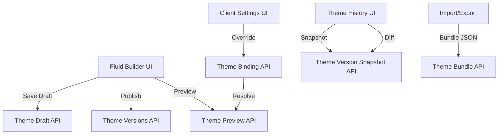
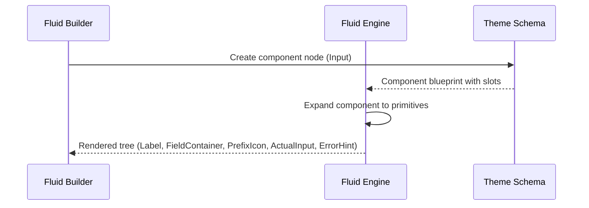
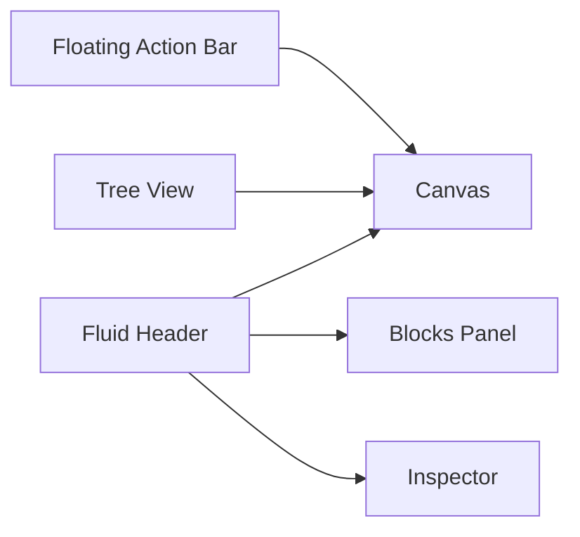
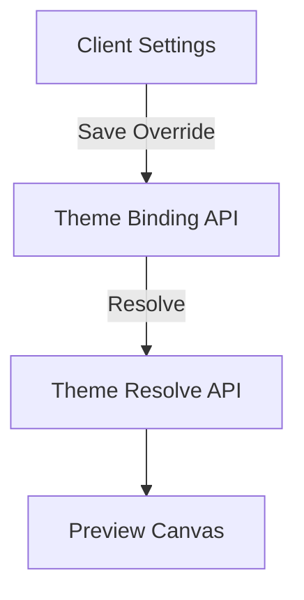
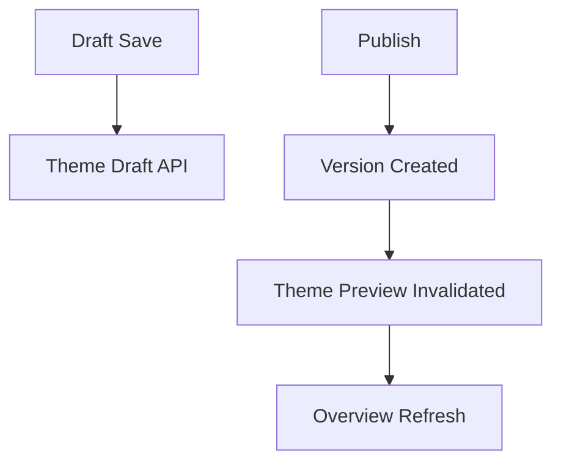

# Fluid Theme Builder LLD

Date: 2026-03-04
Owner: Theme Engine / Fluid
Scope: UI + API + storage for the Fluid theme builder as implemented to date.

## 1. Goals

- Provide a Figma-like layout editor for theme pages driven by Fluid’s box model and composed components.
- Support versioned theme history, snapshots, diffing, and rollback in the admin UI.
- Make the theme builder the source of truth for tokens, layout, nodes, and assets.
- Enable draft editing, publish, preview, and per-client overrides.
- Prepare for import/export and eventual default theme seeding from exported JSON.

## 2. Non‑Goals (for now)

- WYSIWYG typography grid or advanced constraints (e.g., auto‑layout wrap, absolute positioning).
- Per‑page overrides independent of the theme version.
- Asset CDN or external asset management.
- Real‑time collaboration.

## 3. High‑Level Architecture

### 3.1 Modules

- UI
  - Fluid Builder (editor)
  - Theme Overview + History + Settings
  - Client Settings (theme override)
- API
  - Theme CRUD, versions, draft, preview
  - Theme bundle import/export
  - Theme bindings (client override)
- Storage
  - Theme tables, nodes, layout, tokens, assets
  - Draft snapshots and version snapshots

### 3.2 Data Flow Overview

```mermaid
flowchart TD
  A[Fluid Builder UI] -->|Save Draft| B[Theme Draft API]
  A -->|Publish| C[Theme Versions API]
  A -->|Preview| D[Theme Preview API]
  E[Theme History UI] -->|Snapshot| F[Theme Version Snapshot API]
  E -->|Diff| F
  G[Client Settings UI] -->|Override| H[Theme Binding API]
  H -->|Resolve| D
  I[Import/Export] -->|Bundle JSON| J[Theme Bundle API]
```

## 4. Fluid Model

### 4.1 Box Model Evolution

Fluid moved from a flat block model toward a component‑based box model.

- Atomic primitives
  - Box (div/flex)
  - Text
  - Image
  - Icon
  - Input primitive (ActualInput)
- Composed system components
  - Example: Input (component) built from Text, Box, Icon, and ActualInput

### 4.2 Node Shape

- Nodes are stored as a tree.
- Nodes can be either primitives or components.
- Components expand into an internal tree of primitives.
- Nodes may include slots to support nested structures.

### 4.3 Input Component Expansion

Input is a system component expanded into primitives:

- Label [Text] (exposes typography + padding‑bottom)
- FieldContainer [Box] (exposes border + background + padding)
- PrefixIcon [Icon] (optional)
- ActualInput [Primitive]
- ErrorHint [Text] (conditional visibility)

The editor and inspector expose props for label, field container, prefix icon, and error hint slots.

### 4.4 Layout and Sizing

- Flex auto‑layout controls in inspector
  - Direction: row / column
  - Gap: spacing between children
  - Alignment
  - Padding: inner spacing
- Sizing model
  - Fixed
  - Hug (content)
  - Fill (stretch)
- Defaults are applied to new nodes and persisted in draft snapshots.

## 5. UI: Fluid Builder

### 5.1 Major Areas

- Canvas
  - Renders the active page tree.
  - Supports selecting nested nodes.
  - Honors layout, size, and tokens.
- Inspector (right sidebar)
  - Node props and layout editing.
  - Typography, color, padding, margin, etc.
  - Displays contrast warnings when text tokens have poor contrast vs background.
- Tree View
  - Supports nested nodes/slots.
  - Allows selecting nested nodes from the tree.
- Floating Action Bar
  - Undo
  - Redo
  - Inspect mode

### 5.2 Inspect Mode

- Inspects nested elements in the canvas.
- When on, clicking selects nodes without interfering with input fields.
- Inspect mode is toggled from the floating action bar.

### 5.3 Blocks Panel

- Displays available primitives and system components.
- Selecting a block inserts a new node with default layout/size settings.

### 5.4 Panel Composition and Extension Points

Both left-hand panels are schema-driven shells. Their per-item knowledge lives in
`ui/src/features/fluid/model/`, so extending the builder is a data change rather
than a component change.

Sections panel (`FluidBlocksPanel`):

- `model/blockCatalog.ts` — `FluidBlockId`, `BlockCategory`,
  `BLOCK_CATEGORY_ORDER`, and `FLUID_BLOCKS` (node defaults per block), plus the
  pure `filterBlocks` / `groupBlocksByCategory` / `labelForNode` helpers.
- `model/sectionTree.ts` — drag MIME type, indent/depth constants, and the
  non-editable scaffold rows (`Page`, `Layout Container`).
- `components/blocks/` — `SectionTree` / `SectionTreeNode` (recursive rows),
  `BlockPicker` + `BlockCatalogList` (search + grouped catalog),
  `BlockPreview`, `AddBlockButton`, `PageValidationSummary`.
- `hooks/useBlockPicker.ts` and `hooks/useSectionReorder.ts` own picker anchor
  state and drag-reorder wiring. Search and hover state stay inside the picker
  so typing there does not re-render the tree.
- Tree callbacks travel via `blocks/sectionsPanelContext.ts` instead of being
  threaded through every recursion level.

To add a block: add its id to `FluidBlockId`, its definition to `FLUID_BLOCKS`,
and its preview to `BLOCK_PREVIEWS`. The preview registry is keyed by
`FluidBlockId`, so a missing preview is a compile error.

A block whose component is rendered by an inline `case` (rather than by
`componentRegistry` expansion) must be handled in **both** `FluidCanvas` (builder
preview) and `FluidLoginScreen` (runtime). `ProviderButtons` is seeded by
`theme_pages.rs` but was only handled at runtime, so the canvas rendered
"Unknown component: ProviderButtons". The canvas now previews it from the realm's
own providers (`model/providerPreview.ts`, fed by `useIdentityProviders` in
`FluidBuilderPage`) and falls back to a visible placeholder when the realm has
none — the runtime hides the block in that case, but the builder needs the node
to stay selectable.

Theme settings panel (`FluidThemeSettingsPanel`):

- `model/tokens.ts` — token group/key names and fallbacks.
- `model/settingsFields.ts` — `SettingsFieldKind` plus the discriminated union of
  field descriptors.
- `model/themeSettingsSchema.ts` — `THEME_SETTINGS_SECTIONS`, the declarative
  description of what the panel renders.
- `model/layoutShells.ts` — `LayoutShell` ids and gallery options, shared with
  `FluidLayoutGallery`.
- `lib/tokenAccess.ts` — `readTokenGroup` / `readTokenString` /
  `withTokenValue` / `readLayoutShell` / `withLayoutShell`. All token writes go
  through these so sibling tokens are never dropped.
- `components/settings/` — `ThemeSettingsSection`, `ThemeSettingsField` (the
  exhaustive kind switch), and one control per kind under `fields/`. Fields read
  and write draft state through `settings/themeSettingsContext.ts`.

To add a theme property: add its key to `model/tokens.ts` and a descriptor to
`THEME_SETTINGS_SECTIONS`. To add a new control type: add a `SettingsFieldKind`
member, its descriptor to the `SettingsField` union, and a case in
`ThemeSettingsField` — the union's exhaustiveness check flags the missing case.

Rule for the schema: only expose a token that a renderer actually reads. The
renderers consume exactly `colors.{primary,background,text,surface}`,
`typography.{font_family,base_size}` and `radius.base`. A control for anything
else is a control that silently does nothing — the old disabled "Shadow: Soft"
field was exactly that, and has been removed.

Colours may hold either a design-token reference (`var(--primary)`) or a literal
value. `model/designTokens.ts` lists the referenceable tokens and
`controls/ThemeColorControl.tsx` makes the two an explicit choice, previewing a
token's real colour via `resolveCssColor` (`shared/lib/colorUtils.ts`, which reads
custom properties off the document root). Seeded themes reference tokens, so a new
theme inherits the product palette until someone pins a literal.

The `ColorContrast` field kind is read-only and reports WCAG ratios for
`CONTRAST_PAIRS` — the pairs the renderers actually paint, including the primary
button's hard-coded white label. An unresolvable pair reports `n/a` rather than a
failure. `contrastRatio` resolves `var()` values, so the inspector's per-block
check now works on token-based colours too (it previously showed "Unavailable").

### 5.4.2 Theme Modes Removed

ReAuth has no per-theme light/dark mode. The `appearance.mode` token, its settings
control, `resolveThemeMode`, and the light/dark substitution branch of
`resolveThemeColor` are all gone, along with the seeded `appearance` block in
`theme_service.rs::default_tokens` and the UI fallback drafts.

`resolveThemeColor(value, fallback)` now honours a literal value verbatim. It used
to swap known light hexes (`#ffffff`, `#f8fafc`, `#0f172a`, …) for CSS variables
when the resolved mode was dark. Existing themes storing those literals therefore
render exactly what they store instead of following the admin app's mode — which
is the intended semantics now that a theme has one appearance. Stored drafts may
still carry an `appearance` key; it is simply ignored.

### 5.4.1 Side Panel Card Style

`components/controls/BuilderPanelCard.tsx` is the single card shell for both side
panels — elevated `Card`, header with title/description, and an inset
`bg-primary-foreground rounded-2xl p-4` content panel. It mirrors the settings-page
card pattern (e.g. "General Settings" in `FlowDetailsSettingsTab`) so the builder
does not look like a different app. `components/controls/FieldLabel.tsx` gives both
panels the same label treatment. Both sidebars and the sections panel are `w-80`,
so switching left panels does not shift the canvas.

### 5.5 Diff and Snapshot Viewer

- History tab allows opening a snapshot dialog.
- Snapshot dialog shows
  - Snapshot JSON
  - Diff against active version
- Diff filters
  - all
  - tokens
  - layout
  - nodes
- Diff shows additions, removals, and changes.
- Dialog content uses fixed height with inner scroll to prevent animation jumps.

## 6. Theme Overview

- Lists available theme pages and the current draft state.
- Page selector in overview matches the styling and behavior of the Fluid header dropdown.

## 7. Theme History

- Version list (published versions)
- Rollback flow with confirmation when missing flow templates exist
- Snapshot dialog with diff
- “View missing templates” links into Fluid with page query

## 8. Theme Settings

- General settings for theme name and description
- Metadata display (ID, created, updated)
- Client overrides removed from theme settings to avoid duplication

## 9. Client Settings: Theme Override

- Theme override moved to Client Settings (per‑client configuration)
- Supports
  - Theme selection
  - Version selection
  - Save override
  - Remove override
  - Preview resolved theme per client

### 9.1 Override Resolution

- Theme resolution API uses a client_id to resolve an override.
- If no override exists, the realm default is used.

## 10. Preview Refresh

Any of the following invalidate the theme preview cache:

- Publish theme
- Save draft
- Activate version (rollback)
- Switch current theme
- Update override bindings

This prevents hard refreshes from being required in the Theme Preview overview tab.

## 11. Import/Export

- Theme export bundles
  - tokens
  - layout
  - nodes
  - assets (base64)
- Import remaps asset ids in blueprints.

## 12. API Surface (Current)

- Themes
  - `GET /api/realms/:realm/themes`
  - `GET /api/realms/:realm/themes/:theme_id`
  - `PUT /api/realms/:realm/themes/:theme_id`
  - `GET /api/realms/:realm/themes/active`
- Draft
  - `GET /api/realms/:realm/themes/:theme_id/draft`
  - `PUT /api/realms/:realm/themes/:theme_id/draft`
  - `POST /api/realms/:realm/themes/:theme_id/versions/:version_id/draft`
- Versions
  - `GET /api/realms/:realm/themes/:theme_id/versions`
  - `POST /api/realms/:realm/themes/:theme_id/publish`
  - `POST /api/realms/:realm/themes/:theme_id/versions/:version_id/activate`
  - `GET /api/realms/:realm/themes/:theme_id/versions/:version_id/snapshot`
- Preview
  - `GET /api/realms/:realm/themes/:theme_id/preview`
  - `GET /api/realms/:realm/theme/resolve?client_id=...&page_key=...`
- Assets
  - `GET /api/realms/:realm/themes/:theme_id/assets`
  - `POST /api/realms/:realm/themes/:theme_id/assets`
  - `GET /api/realms/:realm/themes/:theme_id/assets/:asset_id`
- Pages
  - `GET /api/realms/:realm/themes/pages`
- Bindings
  - `GET /api/realms/:realm/themes/:theme_id/bindings`
  - `PUT /api/realms/:realm/themes/:theme_id/bindings/:client_id`
  - `DELETE /api/realms/:realm/themes/:theme_id/bindings/:client_id`
  - `GET /api/realms/:realm/themes/client-bindings/:client_id`
- Bundle
  - `GET /api/realms/:realm/themes/:theme_id/export`
  - `POST /api/realms/:realm/themes/:theme_id/import`

## 13. Storage Model (Conceptual)

- Theme
  - id, name, description, created_at, updated_at
- Theme Version
  - id, theme_id, version_number, created_at
- Theme Draft
  - tokens, layout, nodes
- Theme Asset
  - id, theme_id, asset_type, filename, mime_type, data
- Theme Binding
  - id, realm_id, client_id, theme_id, active_version_id

## 14. Component Expansion Flow

```mermaid
sequenceDiagram
  participant UI as Fluid Builder
  participant Engine as Fluid Engine
  participant Schema as Theme Schema

  UI->>Schema: Create component node (Input)
  Schema-->>Engine: Component blueprint with slots
  Engine->>Engine: Expand component to primitives
  Engine-->>UI: Rendered tree (Label, FieldContainer, PrefixIcon, ActualInput, ErrorHint)
```

## 15. Diff Logic (Overview)

- Snapshot diff limited to 200 entries and max depth 5.
- Compares arrays by index and object keys recursively.
- Diff categories inferred from the path prefix:
  - tokens
  - layout
  - nodes

## 16. UX Details and Decisions

- Floating action bar used for undo/redo/inspect to reduce header clutter.
- Snapshot dialog uses fixed height to avoid animation jumps.
- Diff filter buttons always visible even when no results.
- Theme preview is always invalidated on state‑changing actions.
- Client overrides live in Client Settings to keep theme settings clean.

## 17. Known Limitations and Follow‑Ups

- Default theme seeding is still code‑based, not JSON‑driven.
- More robust layout constraints (wrap, absolute) are pending.
- Inspector does not yet include all typography styles and advanced effects.
- Diff visualization is textual, not structural.

## 18. Diagrams

### 18.1 UI Composition

```mermaid
flowchart LR
  A[Fluid Header] --> B[Canvas]
  A --> C[Blocks Panel]
  A --> D[Inspector]
  E[Floating Action Bar] --> B
  F[Tree View] --> B
```

### 18.2 Client Theme Override Flow

```mermaid
flowchart TD
  A[Client Settings] -->|Save Override| B[Theme Binding API]
  B -->|Resolve| C[Theme Resolve API]
  C --> D[Preview Canvas]
```

### 18.3 Publish Flow

```mermaid
flowchart TD
  A[Draft Save] --> B[Theme Draft API]
  C[Publish] --> D[Version Created]
  D --> E[Theme Preview Invalidated]
  E --> F[Overview Refresh]
```

