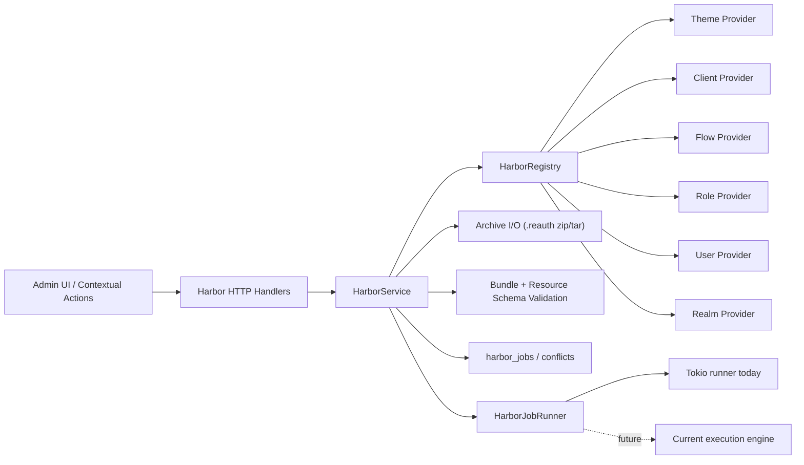
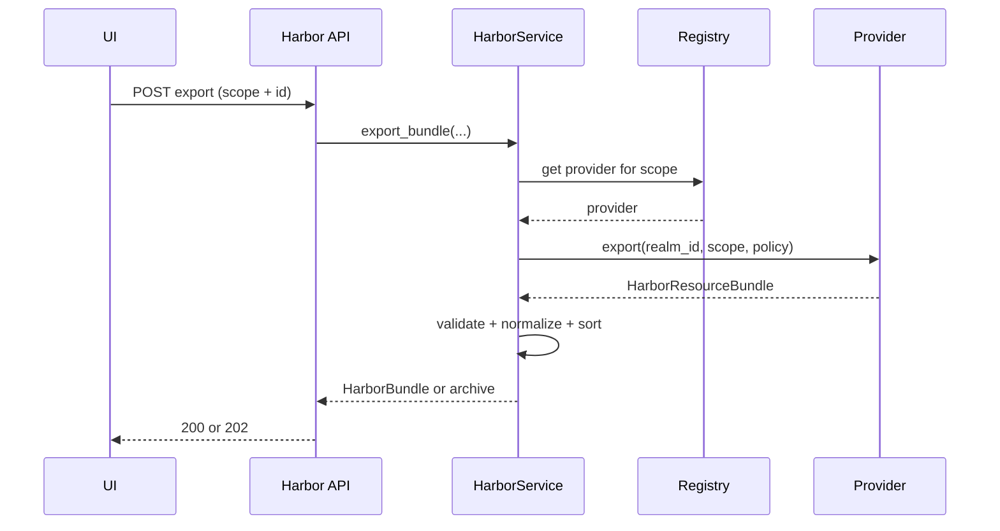
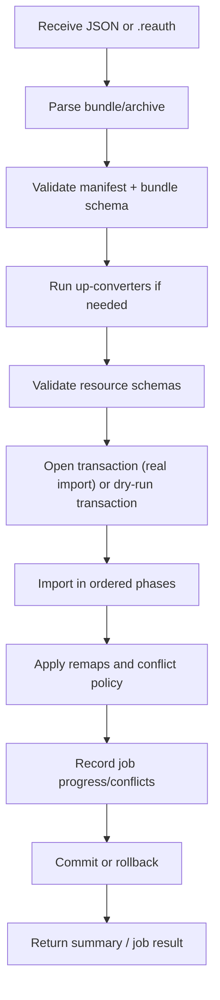
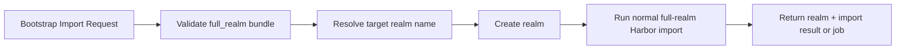

# Harbor Design

Purpose: capture the current Harbor architecture, bundle format, execution model, conflict rules, and implementation logic for ReAuth import/export.

Related docs:
- `docs/memory/harbor-bundle.md`
- `docs/memory/roadmaps/harbor.md`

## 1. Scope

Harbor is ReAuth’s portability subsystem. It handles:
- Atomic portability:
  - single theme
  - single client
  - single flow
  - single user
  - single role
- Full realm snapshots:
  - realm settings
  - themes
  - clients
  - flows
  - roles
  - users

Harbor explicitly does not try to be a generic task engine. It owns:
- bundle structure
- schema validation
- resource-specific import/export semantics
- conflict resolution
- ID/reference remapping

Harbor delegates background execution to a runner abstraction so it can later plug into Current.

## 2. Goals

- Provide a versioned, deterministic, portable realm/config snapshot system.
- Support dev-to-prod portability without hardcoding data in Rust.
- Keep the core engine stable as new resource types are added.
- Allow synchronous imports/exports for small bundles and async jobs for larger ones.
- Make full realm migration possible, including bootstrap into a brand-new realm.

## 3. Non-goals

- Harbor is not the scheduler or global task center.
- Harbor does not yet cover every system resource.
- Harbor does not yet support portable user creation from redacted credential exports.
- Harbor does not yet cover groups/group membership.
- Harbor does not auto-import future realm settings unless they are explicitly versioned into the `realm` provider contract.

## 4. Design principles

- Provider-based orchestration:
  - Harbor core should not know domain-specific serialization details.
- Versioned contracts:
  - bundles are schema-validated and manifest-versioned.
- Explicit conflict semantics:
  - `skip`, `overwrite`, `rename`.
- Deterministic exports:
  - stable resource ordering
  - normalized JSON output
- Realm isolation:
  - imports must not leak identifiers across realms.
- Async-ready:
  - Harbor can run independently now and hand execution to Current later.

## 5. High-level architecture



## 6. Core modules

### Application layer

- `src/application/harbor/service.rs`
  - main orchestrator
  - export/import entry points
  - dry-run execution
  - full-realm ordering
  - remapping logic
  - job updates
- `src/application/harbor/provider.rs`
  - `HarborProvider` trait
  - `HarborRegistry`
- `src/application/harbor/theme_provider.rs`
- `src/application/harbor/client_provider.rs`
- `src/application/harbor/flow_provider.rs`
- `src/application/harbor/role_provider.rs`
- `src/application/harbor/user_provider.rs`
- `src/application/harbor/realm_provider.rs`
- `src/application/harbor/archive.rs`
  - `.reauth` read/write
- `src/application/harbor/schema.rs`
  - JSON schema validation
- `src/application/harbor/bootstrap.rs`
  - create-new-realm bootstrap flow
- `src/application/harbor/runner.rs`
  - async job runner abstraction
- `src/application/harbor/types.rs`
  - shared contracts

### Web layer

- `src/adapters/web/harbor_handler.rs`
  - request parsing
  - sync vs async behavior
  - archive upload/download
  - job endpoints
- `src/adapters/web/router.rs`
  - Harbor route registration

### Persistence / domain

- `src/domain/harbor_job.rs`
- `src/domain/harbor_job_conflict.rs`
- job/conflict repositories
- persisted export artifacts on disk under Harbor storage

### UI

- `ui/src/pages/harbor/HarborDashboardPage.tsx`
- `ui/src/features/harbor/components/HarborJobDetailsSheet.tsx`
- `ui/src/features/harbor/components/HarborResourceActions.tsx`

## 7. Provider pattern

Harbor uses a resource-provider registry so the engine does not become a god object.

Trait:

```rust
#[async_trait]
pub trait HarborProvider: Send + Sync {
    fn key(&self) -> &'static str;
    fn validate(&self, resource: &HarborResourceBundle) -> Result<()>;
    async fn export(&self, realm_id: Uuid, scope: &HarborScope, policy: ExportPolicy)
        -> Result<HarborResourceBundle>;
    async fn import(
        &self,
        realm_id: Uuid,
        scope: &HarborScope,
        resource: &HarborResourceBundle,
        conflict_policy: ConflictPolicy,
        dry_run: bool,
        tx: Option<&mut dyn Transaction>,
    ) -> Result<HarborImportResourceResult>;
}
```

Current registered providers:
- `theme`
- `client`
- `flow`
- `role`
- `user`
- `realm`

Why this matters:
- new resource types can be added without changing Harbor core orchestration
- resource-specific conflict logic stays near the domain
- unit/integration tests stay resource-local

## 8. Harbor data contracts

### 8.1 Policies

- `ExportPolicy`
  - `redact`
  - `include_secrets`
- `ConflictPolicy`
  - `skip`
  - `overwrite`
  - `rename`

### 8.2 Scope

- `theme`
- `client`
- `flow`
- `user`
- `role`
- `full_realm`

### 8.3 Manifest

Manifest fields:
- `version`
- `schema_version`
- `exported_at`
- `source_realm`
- `type`
- `selection`

Validation:
- `exported_at` must be RFC3339
- `source_realm` must be non-empty
- `type` must match the requested scope/export type
- `selection` is used for full-realm exports

### 8.4 Resource bundle

Each resource in `bundle.resources` contains:
- `key`
- `data`
- `assets`
- `meta`

`meta` is used where a resource needs portability metadata beyond the raw payload. The main current example is themes:
- draft existence
- theme metadata
- bindings

## 9. `.reauth` archive format

Harbor archive layout:

```text
bundle.reauth
├── manifest.json
├── data/
│   └── bundle.json
└── assets/
    └── <resource-key>/
        └── <asset-id>__<filename>
```

Rules:
- `manifest.json` must match `bundle.manifest`
- `data/bundle.json` contains the API payload form
- `assets/` mirrors asset blobs on disk
- zip is preferred
- tar, tar.gz, tgz are also supported

Implementation:
- `archive.rs` reads zip/tar
- assets are rehydrated back into `assets[].data_base64`
- export writes both the manifest and pretty JSON bundle

Determinism:
- resources are sorted before export
- assets are sorted before export
- JSON is written in stable pretty-printed order

## 10. Schema validation

Harbor validates at two levels:

### Bundle-level

- `docs/schemas/harbor/bundle.schema.json`
- manifest checks
- resource array checks

### Resource-level

Current resource schemas include:
- theme
- client
- flow
- role
- user
- realm

Validation stages:
1. parse request/archive
2. validate manifest
3. validate bundle schema
4. validate per-resource schema
5. run provider-level semantic validation
6. run optional up-converters for older `schema_version`

## 11. Export flow

### 11.1 Atomic export



### 11.2 Full realm export

Full realm export builds a manifest and then exports selected providers.

Current provider coverage:
- `realm`
- `theme`
- `client`
- `flow`
- `role`
- `user`

Selection is explicit. The UI currently exposes users as a selectable option but does not force them into default “all settings” semantics yet.

### 11.3 Export secrecy rules

Default:
- secrets are redacted

Current examples:
- client secrets can be redacted unless full backup semantics are requested
- user password hashes require `include_secrets=true`

Reason:
- most portability flows are dev/stage/prod config moves, not secret migration

## 12. Import flow



### 12.1 Ordered full-realm import

Current `import_full_bundle()` ordering is:
1. clients
2. roles
3. users
4. flows
5. realm settings/bindings
6. themes

Why this order:
- roles can depend on client namespaces
- users can depend on roles
- realm bindings can depend on remapped flow IDs
- themes may depend on client IDs in bindings

### 12.2 Conflict policy semantics

#### `skip`
- existing target item wins
- resource result is `skipped`

#### `overwrite`
- existing target item is updated in place when supported
- preserves stable references when possible

#### `rename`
- creates a duplicate with a suffixed identifier/name
- Harbor records a conflict log and remap

### 12.3 Remapping logic

Harbor maintains remap tables during full imports:
- `client_id_map`
- `flow_id_map`
- `role_ref_map`

Used for:
- flow graph `client_id` references
- theme bindings
- realm flow bindings
- client-role namespaces
- user direct role assignments

### 12.4 Provider-specific semantics

#### Themes
- supports assets
- exports draft payload + metadata + bindings
- `rename` always creates a duplicate suffixed theme
- same-realm semantic reuse is not allowed to override explicit `rename`

#### Clients
- conflict identity is `client_id` within target realm
- DB uniqueness is `UNIQUE (realm_id, client_id)`
- export accepts current/legacy scope serialization formats

#### Flows
- imports remap flow IDs when cross-realm runtime IDs collide
- client references inside flow graphs are rewritten from `client_id_map`

#### Roles
- supports realm roles and client roles
- client-role namespaces are portable
- imports remap role refs when rename changes role name

#### Users
- exports profile + direct role refs
- `include_secrets=true` exports password hashes
- redacted export stores `${REDACTED}`
- overwrite with redacted credentials preserves existing target password hash
- creating a new user from redacted credentials is rejected
- rename with redacted credentials is rejected

#### Realm
- restores explicit realm settings Harbor owns today
- restores flow bindings
- only versioned Harbor-owned settings belong here

## 13. Dry-run model

Dry-run is transactional validation without persistence.

Behavior:
- validates bundle/schema/provider semantics
- executes import logic in a transaction and rolls back
- returns create/update counts and warnings
- does not persist imported resources

Job behavior:
- Harbor avoids noisy incremental job writes during dry-run paths to reduce lock contention
- final summary still reflects the validation result

## 14. Async job model

Harbor uses threshold-based execution:

- small operations:
  - synchronous `200 OK`
- larger operations:
  - asynchronous `202 Accepted`
  - `job_id` returned

Current config:
- `harbor.async_import_threshold_resources`
- `harbor.async_export_threshold_resources`
- explicit `?async=true|false` overrides

Current runner:
- `TokioHarborJobRunner`

Future target:
- Current will become the shared execution engine
- Harbor will remain the domain-specific orchestration layer

### Job persistence

`harbor_jobs` tracks:
- job type
- status
- scope
- total resources
- processed resources
- created/updated counts
- dry run
- conflict policy
- export artifact metadata
- error message
- timestamps

`harbor_job_conflicts` tracks:
- resource key
- action
- policy
- original identifier
- resolved identifier
- message

## 15. Export artifacts and retention

Async export artifacts are persisted to Harbor storage on disk.

Config:
- `harbor.storage_dir`
- `harbor.cleanup_interval_secs`
- `harbor.artifact_retention_hours`

Cleanup behavior:
- expired files are deleted from disk
- `artifact_*` metadata is cleared
- job status is marked `expired` when its artifact is removed

## 16. Bootstrap import

Bootstrap import creates a new realm from a Harbor full-realm bundle.

Endpoints:
- JSON bootstrap import
- archive bootstrap import

Flow:
1. receive bundle
2. validate it as `full_realm`
3. resolve target realm name:
   - request `realm_name`
   - otherwise `manifest.source_realm`
4. create the realm
5. run standard Harbor full-realm import into the new realm



## 17. API surface

Realm-scoped endpoints:
- `POST /api/realms/{realm}/harbor/export`
- `POST /api/realms/{realm}/harbor/export/archive`
- `POST /api/realms/{realm}/harbor/import`
- `POST /api/realms/{realm}/harbor/import/archive`
- `GET /api/realms/{realm}/harbor/jobs`
- `GET /api/realms/{realm}/harbor/jobs/{job_id}`
- `GET /api/realms/{realm}/harbor/jobs/{job_id}/details`
- `GET /api/realms/{realm}/harbor/jobs/{job_id}/conflicts`
- `GET /api/realms/{realm}/harbor/jobs/{job_id}/download`

Bootstrap endpoints:
- `POST /api/realms/bootstrap/import`
- `POST /api/realms/bootstrap/import/archive`

Request controls:
- `dry_run=true|false`
- `async=true|false`
- `scope`
- `id`
- `selection`
- `conflict_policy`
- `include_secrets`
- `archive_format`

## 18. UI model

### Harbor Management Hub

Main UI:
- export workspace
- import workspace
- recent Harbor jobs
- job details sheet

Behavior:
- uploads `.reauth` or JSON bundles
- supports dry-run and conflict policy
- polls jobs
- shows conflicts and download links
- shows live progress bars

### Contextual Harbor actions

Current pages:
- theme details
- flow details
- client details
- theme builder
- flow builder

These call the same Harbor backend with scoped export/import behavior.

## 19. Configuration

`[harbor]` config in `config/reauth.toml.template`:

- `async_import_threshold_resources`
- `async_export_threshold_resources`
- `cleanup_interval_secs`
- `artifact_retention_hours`
- `storage_dir`

Default storage path:
- `database.data_dir/harbor`

## 20. Seeding integration

Harbor is now part of bootstrapping:
- first boot can import a Harbor bundle
- seeding is no longer a hardcoded Rust-only blueprint path

This makes Harbor the shared portability mechanism for:
- seed defaults
- user export/import
- realm bootstrap

## 21. Testing strategy

Current Harbor coverage includes:
- archive read/write
- dry-run behavior
- bundle schema validation
- conflict handling
- rename behavior
- client ID remapping
- role namespace remapping
- flow ID remapping
- realm binding restoration
- bootstrap import into a new realm
- user import with credentials/direct roles
- rejection of new user creation from redacted bundles

## 22. Current limitations

- groups and group membership are not yet exported/imported
- redacted user bundles cannot create new users
- users are not yet clearly explained enough in the UI to be part of default “All Settings”
- new realm settings require explicit Harbor contract changes
- targeted semantic deduplication is still intentionally limited because explicit `rename` semantics take priority

## 23. Future direction

- add groups and group membership
- define reset/invite/bootstrap policy for redacted user import
- keep realm portability explicit and versioned
- integrate Harbor execution with Current
- add richer diff/merge tooling
- consider bundle signing/encryption

## 24. Operational summary

Harbor MVP is complete for the currently supported resource set.

Today Harbor provides:
- stable bundle contracts
- archive portability
- provider-based orchestration
- sync + async execution
- dry-run validation
- conflict logging
- bootstrap realm creation
- UI management hub
- contextual import/export actions

That makes Harbor the canonical portability path for ReAuth configuration state.
